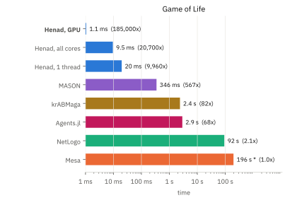
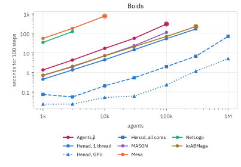

---

**Henad** is a very fast agent-based modelling engine that aims to be the most powerful and flexible ABM engine on personal computers.

Try Henad on https://henad.micfong.space. Documentation is at https://micfong-z.github.io/henad/.

## Benchmarks

<p align="center">
  <picture align="center">
    <source media="(prefers-color-scheme: dark)" srcset="docs/assets/benchmarks/headline_game_of_life_readme-dark.svg">
    <source media="(prefers-color-scheme: light)" srcset="docs/assets/benchmarks/headline_game_of_life_readme-light.svg">
    
  </picture>
  <picture align="center">
    <source media="(prefers-color-scheme: dark)" srcset="docs/assets/benchmarks/boids_seconds_readme-dark.svg">
    <source media="(prefers-color-scheme: light)" srcset="docs/assets/benchmarks/boids_seconds_readme-light.svg">
    
  </picture>
</p>

<p align="center">
  <i>Left: 100 steps of Game of Life on a 1024&sup2; grid. Right: 100 steps of Boids flocking with various population.</i>
</p>

See [Benchmarks](https://micfong-z.github.io/henad/benchmarks/) for more details.

## Screenshots


https://github.com/user-attachments/assets/7ee3fadb-a8fa-4b79-84fa-7b4cd4099f23

## Running Henad

Use any device with a CPU and optionally a GPU, and any OS that can build [wgpu](https://github.com/gfx-rs/wgpu).

> [!warning]
> CPU models run noticably slower on WASM. GPU models appear to have similar performance compared to native builds.
>
> Consider running Henad natively for maximum performance.

### Native

Then, clone the repository and run:

```bash
cargo run --release --bin henad-app
```

Or if you wish to run in headless mode:

```bash
cargo run --release --bin henad-cli
```

### In a browser

The web build runs the same models on the same backends.

```bash
./scripts/build_web.sh serve --release   # http://localhost:8080
./scripts/build_web.sh build --release   # writes dist/
```

Use the build script rather than `trunk` directly.

The script requires `rustup toolchain install nightly --component rust-src --target wasm32-unknown-unknown`.

## Documentation

Full documentation is at https://micfong-z.github.io/henad/, covering installation, the models that ship with the engine, and how to write your own.
It is built from `docs/` with [Zensical](https://zensical.org):

```bash
uv run zensical serve
```

See [CHANGELOG.md](CHANGELOG.md) for changes between versions.

## License

Henad is licensed under [MIT](LICENSE-MIT) OR [Apache-2.0](LICENSE-APACHE), at your option. Bevy has an [excellent explanation](https://github.com/bevyengine/bevy/issues/2373) of what this means. Compiled distributions can additionally include third-party dependencies under their own terms; see the [third-party licenses](https://micfong-z.github.io/henad/license.html) page for more information.
