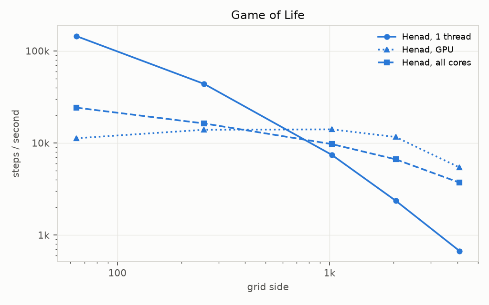
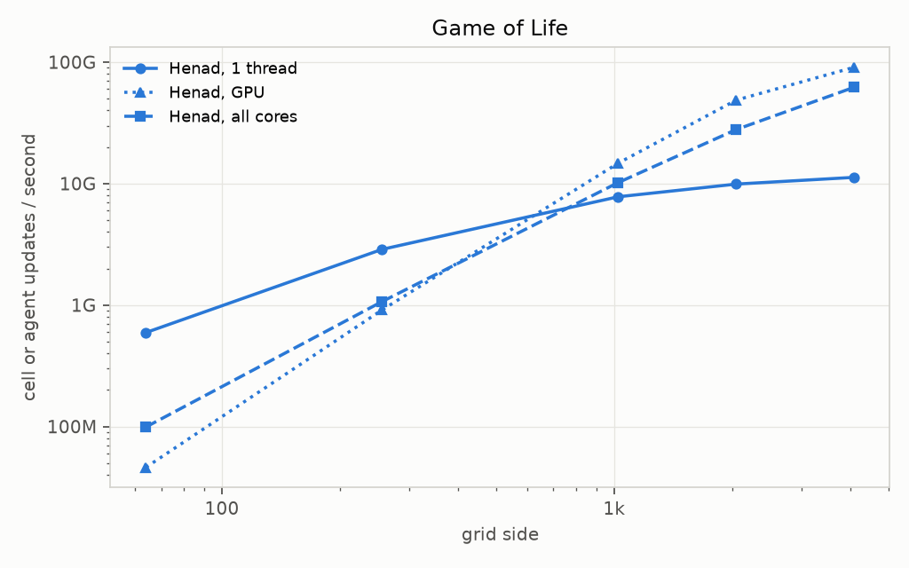
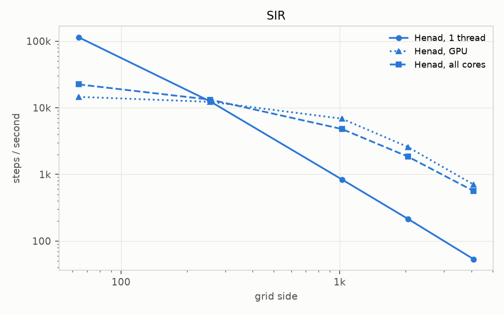
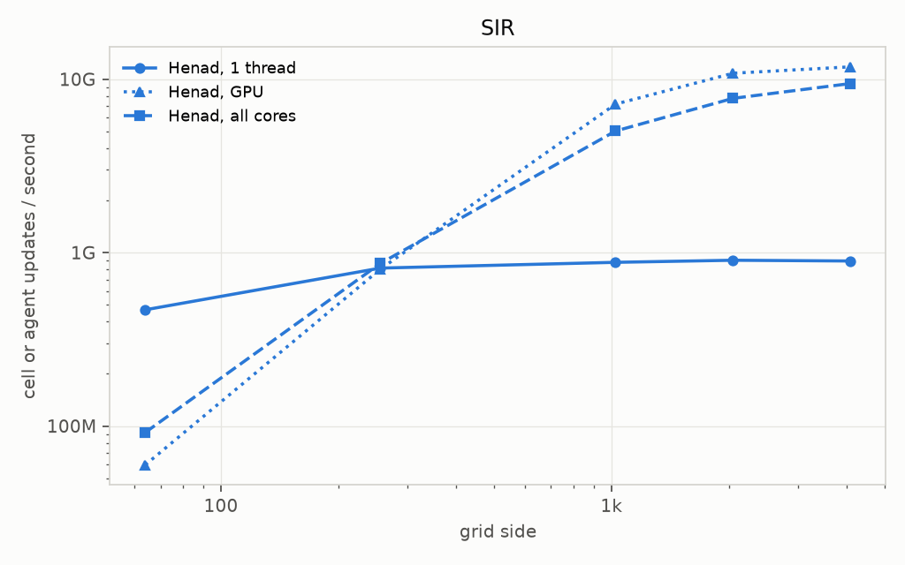
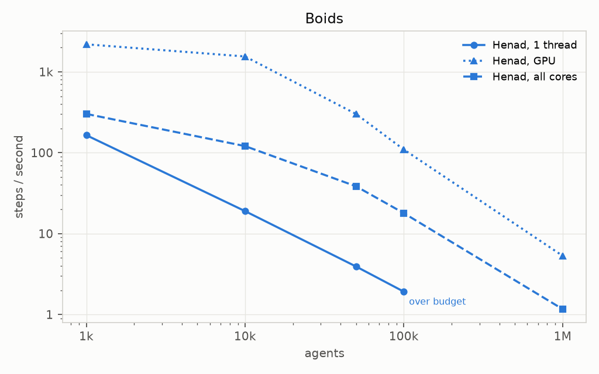
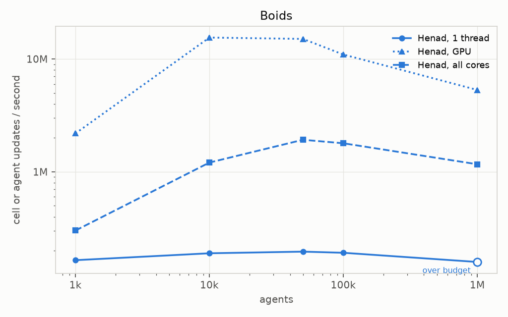
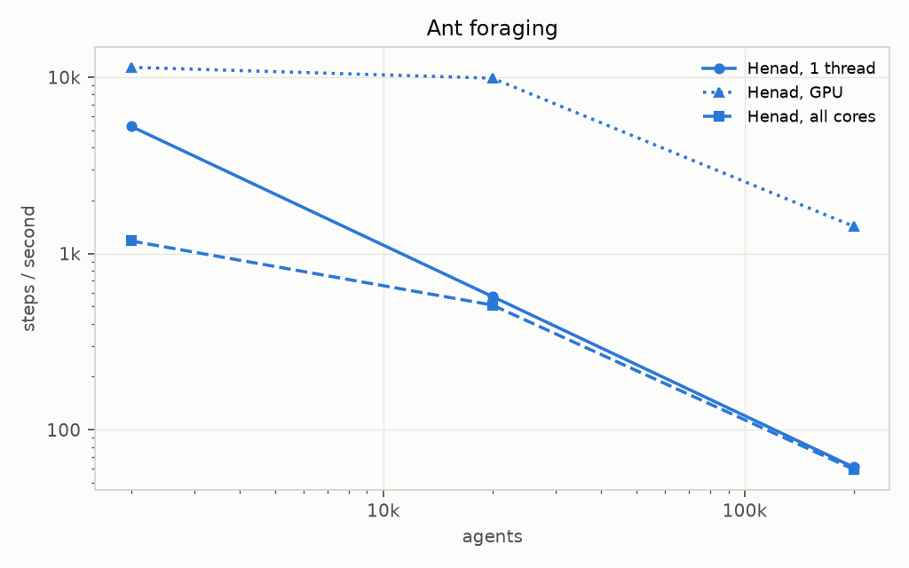
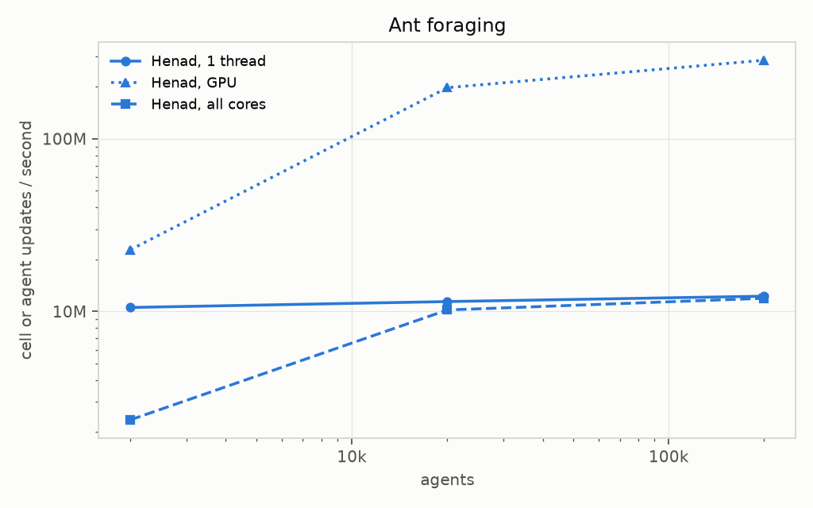

# Benchmarks

Henad against MASON, Agents.jl, NetLogo, Mesa and krABMaga, on the same four models.

!!! warning "What these numbers are"

    Every figure below counts `step()` calls in a release build.
    Construction and warm-up sit outside the timed window, and no run renders anything.
    Two engines are comparable only within one table, on one machine, from one sweep.
    A frame rate is not a benchmark, and neither is a debug build.

!!! failure "Work in progress"

    All five ports are written and every gate they have been run against passes.
    None of them has been timed yet, so every table below holds Henad's own rows and nothing else.

    The numbers that are here need regenerating and should not be cited.
    They came from a laptop that was not idle, from a build whose stamped commit predates two flags
    the driver passes, and every GPU row is a process-cold first rep, which cost the small Game of
    Life and SIR rungs about 2.3x.
    The driver now ramps the device before timing, so a fresh sweep fixes all three at once.

## Method

The comparison holds the model constant and varies the engine.
Every engine runs the same four models, written from the same declarations, and each port is checked against Henad before it is timed.
An engine's own flocking or foraging example is *not* used: it would be a different simulation, and the table would measure the difference between two models rather than between two engines.

### The models

| Model | Topology | What it stresses | Declaration |
|---|---|---|---|
| Game of Life | toroidal grid, synchronous | neighbourhood reads, no randomness at all | `game_of_life_fixture.md` |
| SIR | toroidal grid, synchronous | the same, plus a draw per cell per tick | `sir_fixture.md` |
| Boids | continuous torus | neighbour search at constant density | `boids_fixture.md` |
| Ant foraging | bounded lattice over a scalar field | many agents writing into one cell | `ants_fixture.md` |

The declarations are the fixture documents under `crates/henad-models/tests/fixtures/docs/`.
They state each rule precisely enough to implement from, which is what makes twenty ports one simulation rather than twenty.

### What is timed

The step loop, and nothing else.
Construction, the initial population, warm-up and teardown all sit outside the window, and each engine times itself with its own monotonic clock rather than the wall time of its process.
An engine that compiles or JITs runs one full untimed rep first.

Every rep is recorded and both the tables and the curves report the median.
The driver computes that itself from the per-rep times, so no engine's own arithmetic reaches a published number, and each row says how many reps actually contributed.

### Scale

Grid models climb 64² to 4096²; agent models climb their population at the model's own default density, so the neighbour count per agent stays fixed and a larger run is more agents rather than more work per agent as well.

| Model | Rungs | Steps |
|---|---|---|
| Game of Life, SIR | 64², 256², 1024², 2048², 4096² | 100 |
| Boids | 1k, 10k, 50k, 100k, 1M | 100 |
| Ant foraging | 2k, 20k, 200k | 200 |

Ant foraging stops at 200k because constant density puts twenty field cells behind every ant, and the field is updated per cell per tick.
A larger rung would spend its time on the field rather than on the agents, which is not what an agent-scaling curve is for.

Every rung gets a thousand seconds, spread across its reps.
An engine that cannot finish five reps inside that is recorded as over budget with however many reps it managed, and its curve stops there.
That is the result, not a gap in the data: where an engine runs out of room is most of what this comparison is for, and the engines in this table differ by enough orders of magnitude that no single ladder suits all of them.
Once a rung goes over, the larger ones are not attempted, and a rung that crashes outright stops its ladder the same way.

### Threads

Henad appears three times: on one thread, on every core, and on the GPU.
The reference engines run single-threaded, which is what their own examples do, and krABMaga appears again under its `parallel` feature.
Comparing Henad on one thread against a single-threaded engine is the like-for-like row; the rest shows what the engine does with the hardware it is given.

### Gates

A port is timed only after it agrees with Henad.

| Model | Gate | Why that one |
|---|---|---|
| Game of Life | exact, two 64² patterns for 101 and 500 ticks | deterministic, so anything less would be slack |
| Boids | one tick, 1e-5 absolute | Henad holds `f32` where the others hold `f64`, and the model is chaotic enough that the gap compounds |
| Ant foraging | four ticks, 1e-6 relative, on a scenario that takes no random draw | randomness sits inside the movement rule, so the scenario removes it rather than matching generators |
| SIR | fifty replicates a side, equivalence at 95% on three summary statistics | stochastic per cell per tick, and no two engines share a generator |

`scripts/validate_ports.py` runs them and records a verdict per engine, variant and model.
`compare_bench.py` reads that file and skips anything whose verdict is not `yes`, so a port that fails its gate is not timed and the verdict travels into the results as a column.
Each variant is gated separately, krABMaga's `parallel` build included, which puts the full set at twenty-four rather than the twenty this table shows.

| Engine | Game of Life | Boids | SIR | Ant foraging |
|---|---|---|---|---|
| Mesa 3.5.1 | exact | within 1e-5 | equivalent | within 1e-6 |
| NetLogo 7.0.4 | exact | within 1e-5 | equivalent | within 1e-6 |
| MASON 22 | exact | within 1e-5 | equivalent | within 1e-6 |
| Agents.jl 7.0.3 | exact | within 1e-5 | equivalent | within 1e-6 |
| krABMaga 0.6.2 | exact | within 1e-5 | equivalent | within 1e-6 |

Game of Life is worth a line on its own.
Every port's grid came out bit-identical to the NetLogo fixture recorded for the earlier consistency work, so seven independent implementations of the same rule agree exactly after 101 and 500 ticks: Henad, the five ports, and the original reference.

## Engines and hardware

Numbers from different machines are not comparable, so a sweep is re-run rather than merged.

--8<-- "docs/assets/benchmarks/tables/engines.snippet"

## Results

Henad's own rows, as a baseline for the ports still to come.

Each cell is that engine's median step time against Henad on one thread at the same rung.
Below 1 is faster than Henad on one thread; above 1 is slower.

### Game of Life

{ loading=lazy }

{ loading=lazy }

--8<-- "docs/assets/benchmarks/tables/ratio_game_of_life.snippet"

Both of Henad's parallel backends *lose* to a single thread on a small grid, and cross over somewhere between 256² and 1024².
Four thousand cells is not enough work to pay for a rayon fan-out, and it is far from enough to pay for a round trip to the GPU.

### SIR

{ loading=lazy }

{ loading=lazy }

--8<-- "docs/assets/benchmarks/tables/ratio_sir.snippet"

At Henad's defaults the epidemic burns out fast: susceptibles reach zero by about tick 20 of the 100 timed.
The rest of the window runs on an almost fully recovered grid, where a cell makes no neighbourhood decision and takes no draw, so the row understates what a live epidemic costs.
Every engine runs the same window.
`sir_fixture.md` picks different parameters for exactly this reason, since a gate needs run-to-run spread that these defaults do not leave.

### Boids

{ loading=lazy }

{ loading=lazy }

--8<-- "docs/assets/benchmarks/tables/ratio_boids.snippet"

### Ant foraging

{ loading=lazy }

{ loading=lazy }

--8<-- "docs/assets/benchmarks/tables/ratio_ants.snippet"

!!! note "What these rungs measure"

    No ant reaches the food inside the timed window at any rung here.
    The nest and the food source sit at opposite corners, so the gap grows with the world, and the
    world grows with the population at constant density.
    Measured on Henad: at 2k agents the first delivery lands at tick 900, at 20k the first ant
    picks food up at tick 4250 and none has delivered by tick 12000, and 200k is further again.
    The ladder times 200 ticks.

    So `to_food` stays zero throughout, every ant sees a flat field, and what is timed is a random
    walk plus a full-grid decay pass rather than trail-following.
    Every engine runs that same regime, so the rows stay comparable with each other.
    Reaching the trail-following regime needs either a step count no engine here can afford or a
    changed initial condition, and both are deferred rather than smuggled in.

Ants gains nothing from threads at any rung measured here.
The field update touches twenty cells for every ant and runs over the whole grid, so it dominates the agent pass the threads are there to spread.
Both halves of that update are already parallel, so the ceiling is the work itself rather than a sequential stage.

## Lines of code

How much each model costs to express, counting neither blanks nor comments.
The Agents.jl comparison reports this next to time, and it is worth keeping: an engine that wins on throughput and loses badly here has moved the cost rather than removed it.

Read the column, not the row, and read it loosely.
Henad's files also declare that model's parameters, statistics and display palette, which in most engines live in the harness.
NetLogo's are worse: a model is one file, so its count includes the scenario setup and the fixture export as well as the rule, and its Game of Life is 52 lines of which 9 are the rule.
Making this table fair needs a way to count only the rule, which does not exist yet.

What the counter does know is the language it is reading.
Comments come out by that language's rules, so a Python or Julia docstring is not code and a Rust attribute is not a comment, and a Rust model's own `#[cfg(test)]` block is left out since no port file carries its tests inline.

--8<-- "docs/assets/benchmarks/tables/loc.snippet"

## Divergences

Where two engines cannot be made identical, the difference is stated rather than smoothed over.

- **Boids** holds `f32` in Henad and `f64` almost everywhere else. The two agree to about seven
  digits for one tick and diverge after that, which is why the gate runs one tick.
- **SIR** is compared distributionally. Matching generators across five languages would be a
  different project, and a matched stream would not make the result more true.
- **Ant foraging** carries three deliberate differences from the MASON and krABMaga models it
  descends from: deposits combine with `max` rather than last-writer-wins, the field is read in
  full before any of it is written, and the generator is seeded per chunk per tick. All three are
  what let the tick run in parallel at all.
- **The ant tie-break** is a defect reproduced on purpose. The reference gives the first neighbour
  it visits twice the chance of the others, which drifts ants up and left. Every port reproduces
  it, so the ports stay comparable, but it is not gated and any measurement of how fast ants find
  food is partly measuring it.
- **krABMaga's `parallel` feature does not run agents concurrently.** Its scheduler holds one lock
  on the whole state for each agent's step, so the workers serialise, and the feature also swaps the
  flat field vectors for sharded hash maps. Its row is reported at one effective thread and is
  slower than the default build, which is the measurement, not a mistake.
- **NetLogo's boids sorts its neighbour set**, worth 21% of its step, because the model is the one
  the earlier consistency work validated and was left unchanged rather than tuned for speed. Its
  SIR carries no such cost: the benchmark copy drops the per-patch repaint the validated model
  does in `go`, and both files record what was changed from the copy they came from.
- **Henad's release profile** is `opt-level = 2` rather than 3, chosen for the size of the
  WebAssembly build. krABMaga is built at cargo's own release defaults, which means level 3, and
  the port pins nothing else. Measured interleaved on one thread, level 3 runs Henad's Game of
  Life 1.3% faster and its boids 4.8% slower, so the setting is disclosed rather than changed.
- **krABMaga's boids refuses a world narrower than twice `visual_range`**, a limit of the seam
  probes its neighbour search uses. No rung on this ladder reaches it.

## Reproducing

`benchmarks/README.md` has the prerequisites and the commands.
Engines that are not installed are skipped, so a partial machine still produces a partial table.

```bash
cargo build --release -p henad-cli
uv run --project scripts scripts/validate_ports.py
uv run --project scripts scripts/compare_bench.py
uv run --project scripts scripts/plot_compare.py --publish
```
