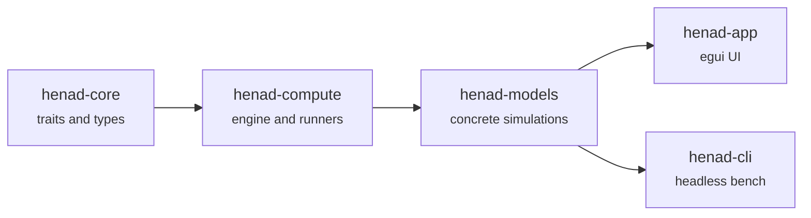

# Architecture

Henad is a workspace of five crates, arranged along one strict dependency direction.

The layers are easiest to follow from the bottom up, since each one depends only on those below it.

**henad-core** sits at the bottom and depends on no other crate, not even wgpu or bytemuck.
With those dependencies absent, the two GPU traits describe their shaders as `&'static str` strings and their buffers as plain bytes.
Alongside the authoring API, the crate holds the `Grid2D<T>` double-buffered grid, the counting-sort `SpatialHash`, parameter descriptors, and the stat and view types the UI reads.

**henad-compute** turns an authoring impl into something runnable.
Its `cpu/` and `gpu/` halves are siblings rather than a base class and a specialisation, and they mirror each other file by file: each half has its own runner, its own engines and its own primitives.
A file name shared across the halves always marks a counterpart, never a coincidence.

**henad-models** holds the eight simulations that ship with the engine.
**henad-app** and **henad-cli** are the two front ends, one graphical and one headless.

## Data layout

Storage is struct-of-arrays throughout: a population is stored as `pos_x: Vec<f32>`, `pos_y: Vec<f32>` and so on, never as a `Vec<Agent>`.
Laid out this way, a kernel's inner loop streams contiguous memory, and rayon can split a lane without splitting an agent.
The `agent_lanes!` macro emits one `Vec<T>` per lane with named field access for the same reason.

Execution follows the layout: rayon runs on every target, the web included, and no kernel has a sequential twin.

## Where a tick runs

Simulation stepping never blocks rendering, on any platform.

=== "Native"

    On native platforms `SimThread` is a real OS thread.
    The UI sends commands over an `mpsc` channel and reads the latest `Snapshot` from behind a mutex, without ever touching the live state directly.

=== "Web"

    The web has no separate thread.
    `SimThread::update()` runs synchronously from `eframe::App::update()` once per frame instead.

The public API is identical on both paths, and nothing in `henad-app` needs to know which backend is active.
rayon still parallelises the kernels either way.

A GPU model is driven differently again.
Its runner encodes many steps into a single submission, capped at 64 steps per submission.
The cap exists because enough passes in one command buffer trips the OS GPU watchdog, which raises no error and no panic and leaves every later readback silently reading zero.

## Snapshots and views

When the sim thread publishes, `build_snapshot` calls `prepare_view` first.
Inside that call a model turns its state into something drawable, and ants uses it to quantise its `f32` pheromone field into palette indices.
Publishing happens a few times a second rather than thousands of times, so anything a view needs but a step does not belongs in `prepare_view`.

For a GPU grid, the display is a sampled texture rather than a mirror of the grid.
A texture with one texel per cell would cap the grid at the device's maximum texture dimension and cost four bytes per cell, which at 16384² comes to over a gigabyte of RGBA for something drawn into a panel roughly a thousand pixels wide.
Each axis is capped instead, and the display pass reads the cell at `texel * grid / tex`.

## Failure handling

wgpu treats any error that no error scope claims as fatal.
Model construction therefore runs inside error scopes covering all three filters, and `GpuContext::new` installs an uncaptured-error handler as the floor under every path no scope reaches, egui's own rendering included.
Error scopes are thread-local, and a scope pushed on the UI thread never sees what a sim thread does.
The uncaptured-error handler covers that gap.

A model too large for the device is refused before anything is allocated.
`gpu/capacity.rs` computes buffer sizes, texture dimensions and per-pass storage-binding counts from what the model already declares.
The app disables Build, and both engines assert with a readable message.

A panicking kernel is caught as well.
Both sim threads wrap the run loop in a panic catch once at thread start, outside the loop, which keeps the catch off the per-tick path.

## Further reading

Session hand-off notes for every coding session since 2026-08-12 are published under **Agent session records**.
They record why a given split, trait boundary or crate placement ended up the way it is.

[The CPU backend](cpu-backend.md) and [the GPU backend](gpu-backend.md) each go a level deeper on their half of the engine.
