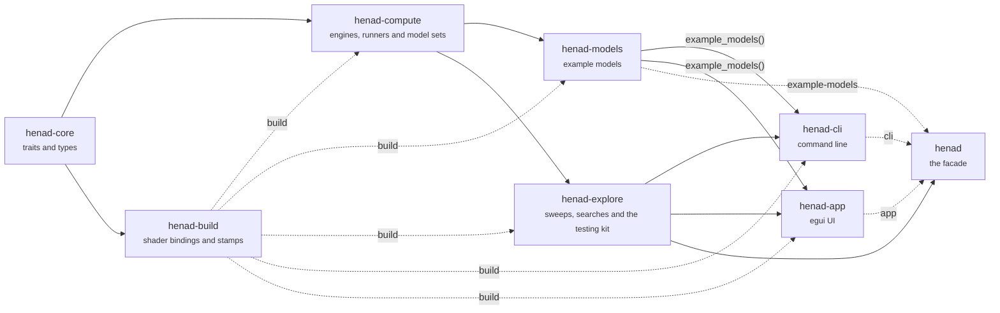

# Architecture

Henad is a workspace of eight crates, all published to crates.io at one version.
henad-core depends on no other crate, and henad-build on henad-core alone.
Every other dependency runs from a crate to one drawn above it in the graph below, and a crate with WGSL or a commit stamp takes henad-build as a build dependency.
henad-models and henad-explore take no normal dependency on each other, and the two front ends reach the example models only for `example_models()`, behind their default `example-models` feature.
The facade, `henad`, sits over all of them, and is the one crate a program depends on.

```mermaid
graph LR
  core["henad-core<br/><small>traits and types</small>"] --> compute["henad-compute<br/><small>engines, runners and model sets</small>"]
  core --> build["henad-build<br/><small>shader bindings and stamps</small>"]
  build -. "build" .-> compute
  build -. "build" .-> models
  build -. "build" .-> explore
  build -. "build" .-> cli
  build -. "build" .-> app
  compute --> models["henad-models<br/><small>example models</small>"]
  compute --> explore["henad-explore<br/><small>sweeps, searches and the testing kit</small>"]
  explore --> cli["henad-cli<br/><small>command line</small>"]
  explore --> app["henad-app<br/><small>egui UI</small>"]
  models -- "example_models()" --> cli
  models -- "example_models()" --> app
  explore --> facade["henad<br/><small>the facade</small>"]
  models -. "example-models" .-> facade
  cli -. "cli" .-> facade
  app -. "app" .-> facade
```

The layers are easiest to follow from the bottom up, since each one depends only on those below it.

**henad-core** sits at the bottom and depends on no other crate, not even wgpu or bytemuck.
With those dependencies absent, the two GPU traits describe their shaders as `&'static str` strings and their buffers as plain bytes.
Alongside the authoring API, the crate holds the `Grid2D<T>` double-buffered grid, the counting-sort `SpatialHash`, the `Network` graph, parameter and action descriptors, the stat and view types the UI reads, and the provenance types that name a build.

**henad-build** runs from the build scripts of the crates with WGSL or a commit stamp.
It composes each crate's shaders with the shared modules henad-core holds as text, which a shader reaches with `#import henad::<module>`, and writes the Rust bindings that `include_shaders!` brings into the crate.
Its `stamp_commit` records the commit a crate was built from, whether its sources differed from it, and a hash of the sources.

**henad-compute** turns an authoring impl into something runnable.
Its `cpu/` and `gpu/` halves are siblings rather than a base class and a specialisation, and they mirror each other file by file: each half has its own runner, its own engines and its own primitives.
A file name shared across the halves always marks a counterpart, never a coincidence.
Network models are the exception to the mirroring.
They run on the CPU only, and their engine has no counterpart in `gpu/`.

henad-compute also holds the model set.
A `register_*` function type-erases a model into a `ModelEntry`.
The entry holds no device until a host builds it on one.
The engines and kernels are generic, and they compile in the crate that calls `register_*`.
A `ModelSet` holds the entries a host offers, each id once, and records the build of the crate that inserted each one.
Its `gpu_needs` merges what every GPU entry binds above the WebGPU baseline, and a host requests its device for that before any model builds.
`Simulation` is the programmatic API over an entry.

**henad-models** holds the ten example models.
**henad-explore** runs parameter sweeps and searches.
It reads a spec, plans every config and replicate, steps several runs at once and writes each one's results to an output directory.
A CPU model's runs step in lanes of their own, and a GPU model's runs share the device on tracks.
It resumes a sweep that stopped part way, and merges the directories of a sweep split into shards.
A search asks one of four methods for a batch of configs, runs the batch as a sweep runs its configs, and tells the method the results before it asks again.
The app runs its sweeps through the same crate, on a thread of their own or, in a browser, between frames.
It also acquires a headless GPU device for the command line and for any sweep handed no device, as the app's sweeps are, and holds the testing kit a model's tests run.
The parts of a sweep that need no engine, such as designs, seeds, reducers and summaries, sit in `henad_core::explore`, and so do the search methods.
**henad-app** and **henad-cli** are the two front ends, one graphical and one headless, each a library over a host's model set with Henad's own binary on top.

**henad** re-exports the others under one module tree, the example models, the app, the command line and the testing kit each behind a feature.
It defines nothing of its own.
[The API reference](../reference/api.md) lists its modules.

Two dev-dependencies run against the graph.
henad-explore's tests run the example models, and henad-models' tests run the testing kit.
These two are the only dev-only edges the normal graph does not hold, and neither normal graph reaches the other.

Two more crates sit outside the published set.
`examples/tutorial` holds the finished code of the first-model guide, depends on the facade as a reader's crate does, and tests each tutorial model against the example model it teaches.
`templates/model-project` is the project a user fetches from a release, outside the workspace, built on the published `henad` and `henad-build` alone.

## Data layout

Storage is struct-of-arrays throughout: a population is stored as `pos_x: Vec<f32>`, `pos_y: Vec<f32>` and so on, never as a `Vec<Agent>`.
Laid out this way, a kernel's inner loop streams contiguous memory, and rayon can split a lane without splitting an agent.
The `agent_lanes!` macro emits one `Vec<T>` per lane with named field access for the same reason.

Execution follows the layout: rayon runs on every target, the web included, and no kernel has a sequential twin.

## Where a tick runs

Simulation stepping never blocks rendering, on any platform.

=== "Native"

    On native platforms `SimThread` is a real OS thread.
    The UI sends commands over an `mpsc` channel and reads the latest `Snapshot` from behind a mutex, without ever touching the live state directly.

=== "Web"

    The web has no separate thread.
    `SimThread::update(dt)` runs synchronously from `HenadApp::logic`, eframe's per-frame hook, once per frame instead.

The public API is identical on both paths, and nothing in `henad-app` needs to know which backend is active.
rayon still parallelises the kernels either way.

Commands from the UI are handled between ticks.
They include the actions a model declares, such as clearing the Game of Life grid.
An action is a one-off change to the state.
It leaves the tick where it is, and the runner publishes a snapshot straight away.
A network model's layout runs when a snapshot is published, outside any tick.

A GPU model is driven differently again.
Its runner encodes many steps into a single submission, capped at 64 steps per submission.
The cap exists because enough passes in one command buffer trips the OS GPU watchdog, which raises no error and no panic and leaves every later readback silently reading zero.
An action on a GPU model goes out in a submission of its own.

## Snapshots and views

When the sim thread publishes, `build_snapshot` calls `prepare_view` first.
Inside that call a model turns its state into something drawable, and ants uses it to quantise its `f32` pheromone field into palette indices.
While a model runs, the runner publishes at most once every 16 ms, about 60 times a second.
A fast model steps thousands of times in that second.
Anything a view needs but a step does not belongs in `prepare_view`.

A network model publishes its edges alongside its nodes, and the app draws them under the nodes.
The edge list is copied only when the graph's version or the list's length differs from the recycled snapshot's.

After `prepare_view`, `build_snapshot` runs a network's layout for a time budget, and [the CPU backend](cpu-backend.md#the-runner) covers which publishes move the nodes.

For a GPU grid, the display is a sampled texture rather than a mirror of the grid.
A texture with one texel per cell would cap the grid at the device's maximum texture dimension and cost four bytes per cell, which at 16384² comes to over a gigabyte of RGBA for something drawn into a panel roughly a thousand pixels wide.
Each axis is capped instead, and the display pass reads the cell at `texel * grid / tex`.

## Failure handling

wgpu treats any error that no error scope claims as fatal.
Model construction therefore runs inside error scopes covering all three filters, and `GpuContext::new` installs an uncaptured-error handler as the floor under every path no scope reaches, egui's own rendering included.
Error scopes are thread-local, and a scope pushed on the UI thread never sees what a sim thread does.
The uncaptured-error handler covers that gap.

A model too large for the device is refused before anything is allocated.
`gpu/capacity.rs` computes buffer sizes, texture dimensions and per-pass storage-binding counts from what the model already declares.
The app disables Build, and both engines assert with a readable message.

A panicking kernel is caught as well.
Both sim threads wrap the run loop in a panic catch once at thread start, outside the loop, which keeps the catch off the per-tick path.

## Further reading

Session hand-off notes for every coding session since 2026-08-12 are published under **Agent session records**.
They record why a given split, trait boundary or crate placement ended up the way it is.

[The CPU backend](cpu-backend.md) and [the GPU backend](gpu-backend.md) each go a level deeper on their half of the engine.
