# App tour

We will walk through the Henad UI, give you an overview of its features and how to use them.
Before we start, make sure you have [installed Henad](installation.md) and can [run it](running.md).

<figure markdown="span">
  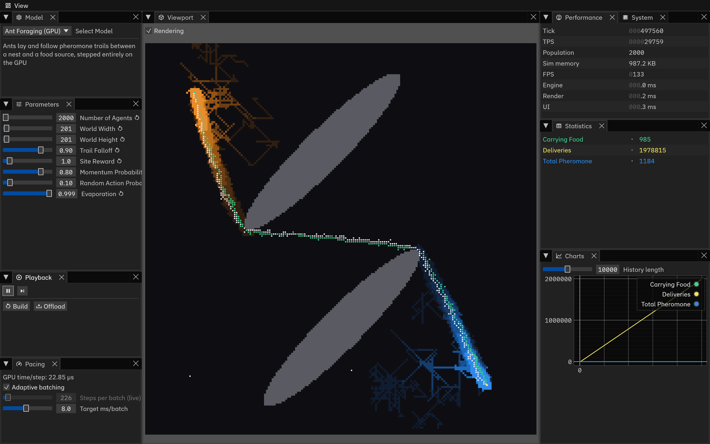{ width="900" }
<figcaption>Ant Foraging (GPU) at roughly 30,000 ticks per second.</figcaption>
</figure>

## Overview

Henad uses a docking UI powered by [egui_dock](https://github.com/anhosh/egui_dock).
You can resize each panel, collapse or expand them, move them around, and even drag a tab into its own window.

In the menu bar, :material-view-dashboard-outline: View lists all nine tabs and highlights the open ones, and is the only way to reopen a tab you closed.
Click :material-restart: Reset layout at the bottom to put everything back to default layout, in case the workspace gets too messy.

| Tab                                                                      | Content                      |
| ------------------------------------------------------------------------ | ---------------------------- |
| :material-cube-outline: Viewport        | Simulation visualization     |
| :material-play-circle-outline: Playback | Play, step, build, offload   |
| :material-speedometer: Pacing           | Speed control                |
| :material-cog-outline: Model            | Model selection              |
| :material-tune: Parameters              | Model parameters             |
| :material-table: Statistics             | Latest value of each stat    |
| :material-chart-line: Charts            | Statistics history and plots |
| :material-gauge: Performance            | Performance metrics          |
| :material-chip: System                  | Backend information          |

## :material-cog-outline: Model tab

<figure markdown="span">
  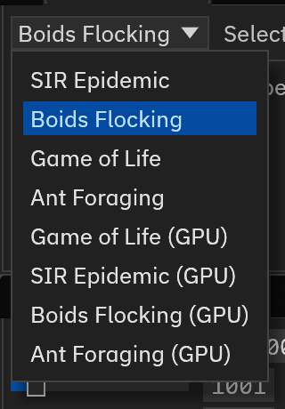{ width="240" }
<figcaption>Eight default Henad models.</figcaption>
</figure>

Use the dropdown to pick a model.
Picking a model also loads its default parameters, discarding parameters set in :material-tune: Parameters tab.

The GPU model entries only appear when a suitable device is detected.

See the [models reference](../reference/models.md) for more details on each model.

## :material-tune: Parameters tab

This tab shows the parameters of the selected model, and you can change them using the sliders or text boxes.

<figure markdown="span">
  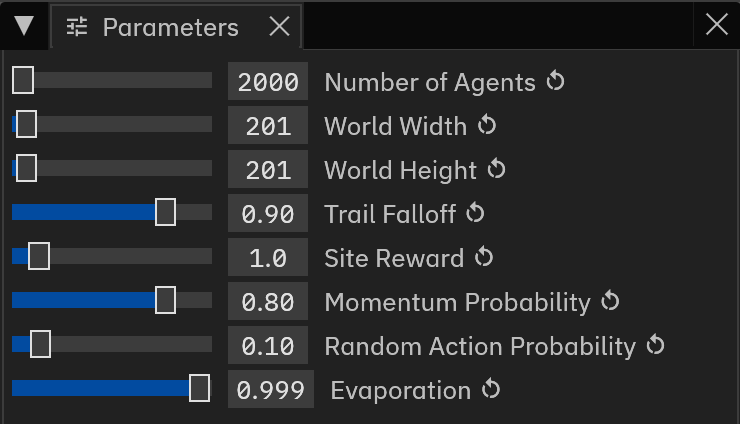{ width="370" }
<figcaption>Parameters for the Ant Foraging model on the GPU.</figcaption>
</figure>

A parameter can either be **live** or **reload**.

Live
: Takes effect on the next tick. This means that you can change it while the simulation is running, and see the effect immediately.

Reload
: Only read when the model is (re)built. They always carry a :material-restart: marker.
  Editing a reload parameter while a simulation is running will turn the label amber, with a **:material-alert: Reload needed** banner.
  Nothing is lost, and nothing is applied until you press :material-restart: Build.

<figure markdown="span">
  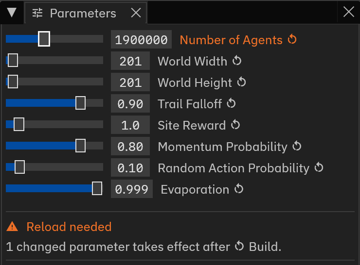{ width="370" }
<figcaption>Editing a reload parameter while a simulation is running.</figcaption>
</figure>

There are 4 possible banners:

| Banner                                      | Meaning                                                                |
| ------------------------------------------- | ---------------------------------------------------------------------- |
| :material-information: No simulation loaded | Nothing built yet. Parameters apply on the first build.                |
| :material-alert: Selected model not loaded  | A model different from the running one is selected.                    |
| :material-alert: Reload needed              | Some reload parameters have been edited but not applied.               |
| :material-alert: Too large for this device  | The selected parameters require too much resources. Try lowering them. |

## :material-play-circle-outline: Playback tab

<figure markdown="span">
  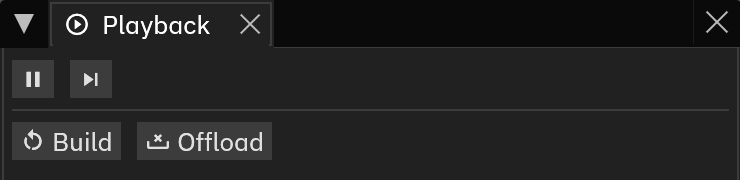{ width="370" }
<figcaption>Playback tab while a simulation is running.</figcaption>
</figure>

:material-play: / :material-pause:
: Start or pause the simulation.

:material-skip-next:
: Advance one tick while paused.

:material-restart: Build
: Construct the selected model from the current parameters, replacing the running simulation if it exists.

:material-tray-remove: Offload
: Remove the simulation from memory and free its resources. This also terminates the running simulation if it exists.

## :material-speedometer: Pacing tab

The :material-speedometer: Pacing tab controls how fast the simulation runs.
The controls for CPU and GPU models are different due to the different ways they run.

=== "CPU model"

    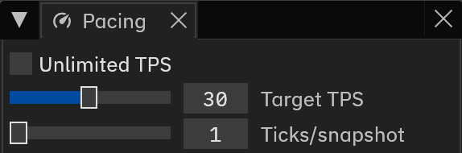{ width="370" }

    **Unlimited TPS** removes the speed cap and lets the sim thread run as fast as it can.
    This is generally favorable as it delivers results quickly, but it can be difficult to see the visualization clearly at this speed.

    **Target TPS** sets the maximum ticks per second.

    **Ticks/snapshot** sets how many ticks pass between published snapshots.
    This controls how frequently the viewport and the statistics are updated.

=== "GPU model"

    The GPU is also needed to render the UI, so more complex pacing controls is required.

    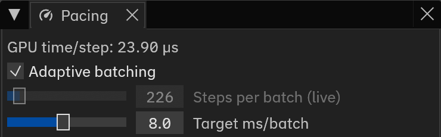{ width="370" }

    **GPU time/step** is the time the GPU spent on the last tick.

    **Adaptive batching** automatically calculates how many steps should the GPU run each batch, aiming to keep each batch under **Target ms/batch**.

    **Target ms/batch** sets the maximum time the GPU should spend on each batch. This affects FPS of the UI.

    **Steps per batch** sets how many steps the GPU runs each batch.
    This is analogous to **Ticks/snapshot** for CPU models.

## :material-cube-outline: Viewport tab

<figure markdown="span">
  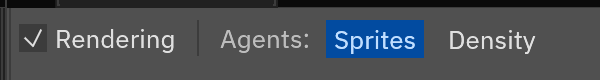{ width="330" }
</figure>

**Rendering** turns drawing off without stopping the simulation.

**Agents** controls agent model's rendering mode, either as individual sprites or as a density heatmap.

=== "Sprites"

    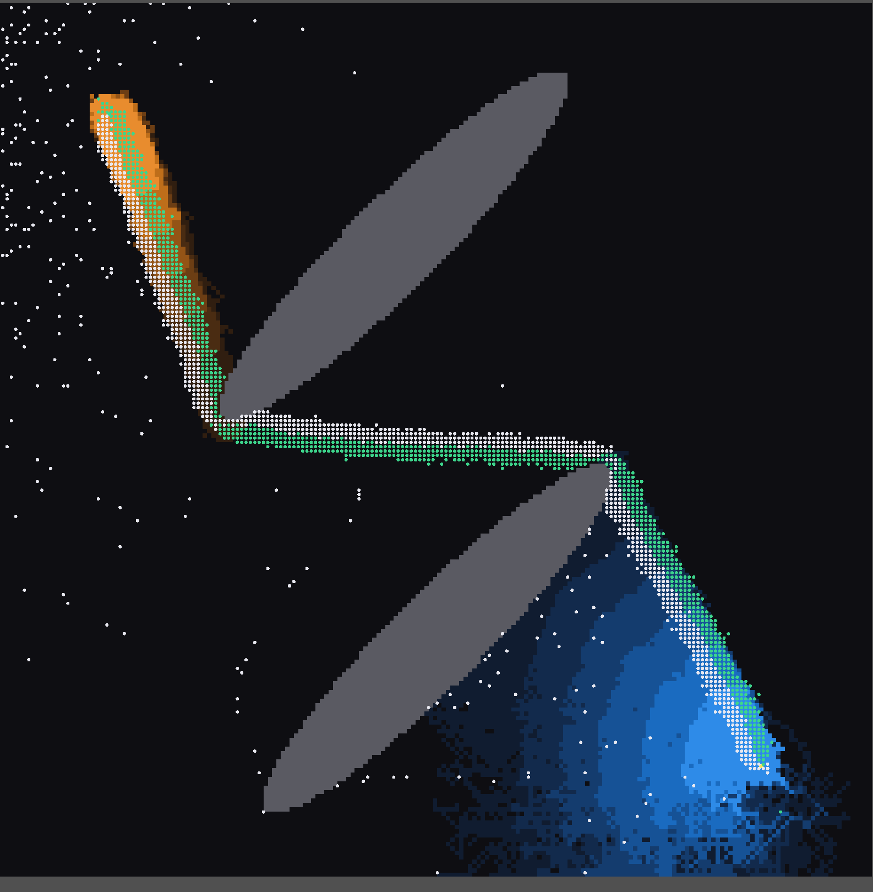{ width="620" }

=== "Density"

    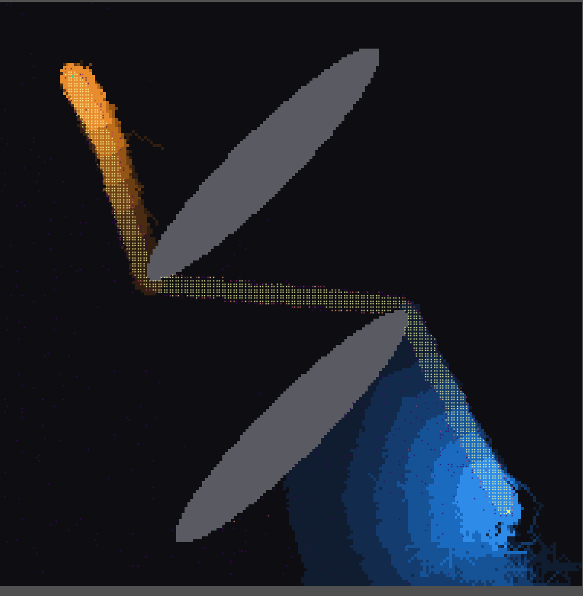{ width="620" }

A model with both a [field](../authoring/fields.md) and a population draws the field first and the agents over the top.

## :material-table: Statistics tab

<figure markdown="span">
  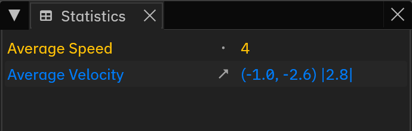{ width="420" }
<figcaption>Each stat is drawn in the colour the model declared for it.</figcaption>
</figure>

Models can register [statistics](../authoring/statistics.md) to be published every tick.
The latest values are shown in the :material-table: Statistics tab, and the historical data are plotted in the :material-chart-line: Charts tab.

There are three types of statistics available:

| Icon                                                | Kind      | Shown as                         |
| --------------------------------------------------- | --------- | -------------------------------- |
| :material-circle-small:{ title="Scalar" }           | Scalar    | A single rounded number          |
| :material-arrow-top-right-thin:{ title="Vector2D" } | Vector2D  | `(x, y)` and its magnitude       |
| :material-chart-histogram:{ title="Histogram" }     | Histogram | `n=` the total count across bins |

## :material-chart-line: Charts tab

<figure markdown="span">
  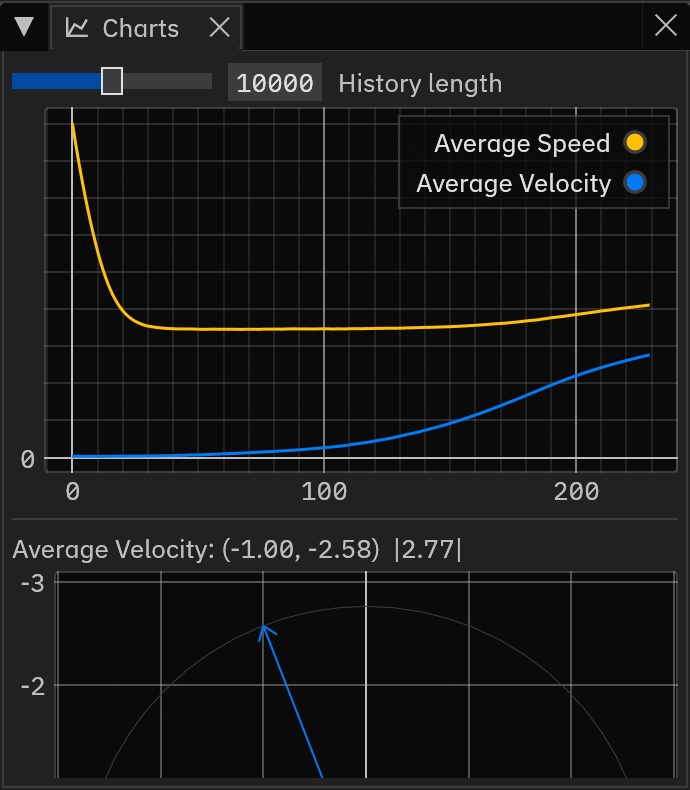{ width="420" }
<figcaption>The charts panel shows the historical data for each stat.</figcaption>
</figure>

Every stat contributes a line to one time series, plotted against tick.
Each non-scalar stat are also plotted for the latest snapshot: an arrow from the origin for a vector, with a circle at its current magnitude, and a bar chart for a histogram.

The charts are powered by [egui_plot](https://github.com/emilk/egui_plot).
Drag to pan, scroll to zoom, and click a legend entry to show/hide that series.

**History length** sets how many snapshots are kept.
Shrinking it deletes the oldest samples.

## :material-gauge: Performance tab

<figure markdown="span">
  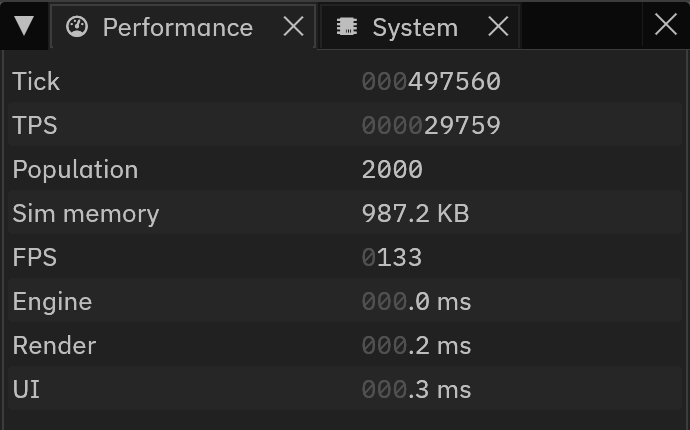{ width="420" }
<figcaption>The performance panel shows various performance metrics.</figcaption>
</figure>

Tick
: Ticks completed since the model was built.

TPS
: Ticks per second the sim thread is actually achieving.

Population
: Number of agents for an agent model, number of cells for a grid model.

Sim memory
: Memory used by the simulation.

FPS
: Frames per second of the UI.
  Usually unrelated to TPS.

Engine
: Time for one tick inside the engine.

Render
: Time spent drawing the simulation this frame.

UI
: Time spent drawing the UI this frame.

!!! warning "FPS is unrelated to model performance"

    Note that the FPS and the TPS are unrelated and each can be configured in different ways, as explained in the [:material-speedometer: Pacing tab](#pacing-tab).
    The TPS is the true measure of how fast the simulation is running.

## :material-chip: System tab

<figure markdown="span">
  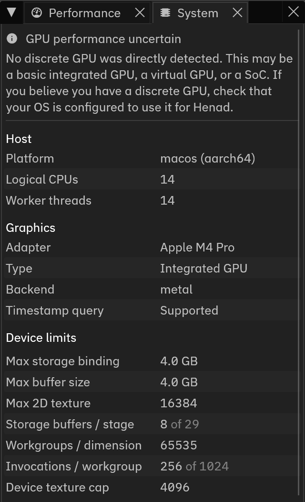{ width="380" }
<figcaption>Host, adapter and device limits information.</figcaption>
</figure>

Information in the :material-chip: System tab are generally technical information used for debugging purposes.
It can also be used to check if the correct GPU adapter is being used, and if the device has enough resources to run a model.

A banner at the top appears when there are potential compatibility issues with the GPU, and can be one of the following:

| Banner                                           | Issue                                                                               |
| ------------------------------------------------ | ----------------------------------------------------------------------------------- |
| :material-information: GPU performance uncertain | No discrete GPU was directly detected. This may or may not affect performance.      |
| :material-alert: No GPU detected                 | Rendering is going through a software rasteriser, and GPU models will be very slow. |

## Model build and simulation errors

Henad checks a model's buffer sizes, texture dimensions and per-pass binding counts against the device before models are built.
If a model cannot be built, :material-restart: Build is disabled, and the limits that were exceeded are shown in the :material-tune: Parameters tab's banner.

At runtime, there are two possible errors that can occur:

Model build failed
: The GPU refused the model while it was being constructed, or a kernel panicked during setup.

Simulation aborted
: Something went wrong on a tick, and the simulation was stopped.

When such an error occurs, a modal dialog appears with the error message.

## Browser-specific notes

Although Henad is designed so that the web app runs identically to the native app, there are some differences due to the limitations of the web platform:

- **GPU time/step** reads `N/A` due to backend limitations.
- Device limits can be lower than the native app as broswers may not expose the full capabilities of the GPU.
- Append `?threads=N` to the URL to cap the worker pool.

*[UI]: User interface
*[TPS]: Ticks per second
*[FPS]: Frames per second
*[CPU]: Central processing unit
*[GPU]: Graphics processing unit
*[SoC]: System on a chip
*[stat]: Statistic