# App tour

We will walk through the Henad UI, give you an overview of its features and how to use them.
Before we start, make sure you have [installed Henad](installation.md) and can [run it](running.md).

<figure markdown="span">
  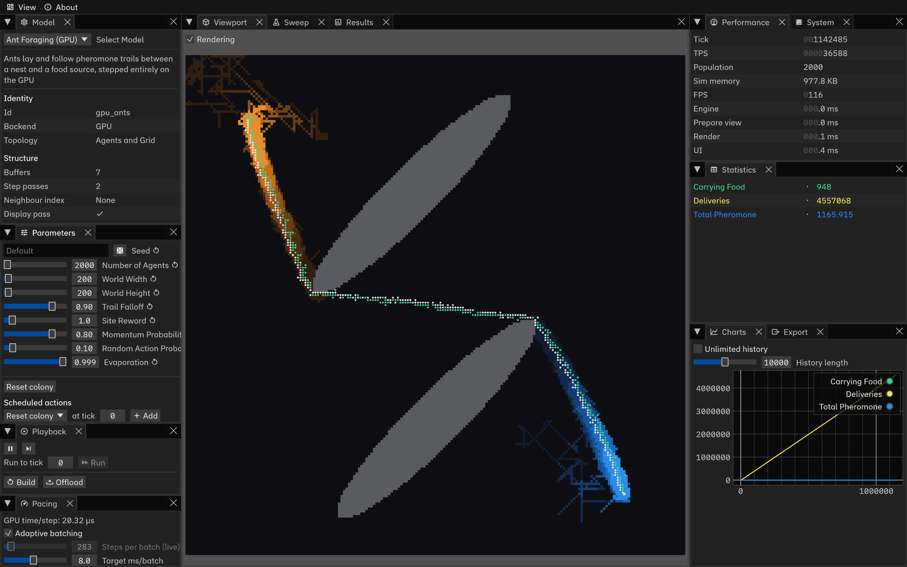{ width="900" }
<figcaption>Ant Foraging (GPU) at roughly 35,000 ticks per second.</figcaption>
</figure>

## Overview

Henad uses a docking UI powered by [egui_dock](https://github.com/anhosh/egui_dock).
You can resize each panel, collapse or expand them, move them around, and even drag a tab into its own window.

In the menu bar, <span class="ui" markdown>:material-view-dashboard-outline: View</span> lists all 12 tabs and highlights the open ones, and is the only way to reopen a tab you closed.
Click <span class="ui" markdown>:material-restart: Reset layout</span> at the bottom to put everything back to default layout, in case the workspace gets too messy.

| Tab                                                                      | Content                                 |
| ------------------------------------------------------------------------ | --------------------------------------- |
| <span class="ui" markdown>:material-cube-outline: Viewport</span>        | Simulation visualization                |
| <span class="ui" markdown>:material-play-circle-outline: Playback</span> | Play, step, run to tick, build, offload |
| <span class="ui" markdown>:material-speedometer: Pacing</span>           | Speed control                           |
| <span class="ui" markdown>:material-cog-outline: Model</span>            | Model selection and metadata            |
| <span class="ui" markdown>:material-tune: Parameters</span>              | Model parameters, seed and actions      |
| <span class="ui" markdown>:material-flask-outline: Sweep</span>          | Parameter sweeps, searches and progress |
| <span class="ui" markdown>:material-chart-box-outline: Results</span>    | Plots and runs of a sweep or search     |
| <span class="ui" markdown>:material-table: Statistics</span>             | Latest value of each stat               |
| <span class="ui" markdown>:material-chart-line: Charts</span>            | Statistics history and plots            |
| <span class="ui" markdown>:material-application-export: Export</span>    | Writing results to a file               |
| <span class="ui" markdown>:material-gauge: Performance</span>            | Performance metrics                     |
| <span class="ui" markdown>:material-chip: System</span>                  | Backend information                     |

## :material-cog-outline: Model tab

<figure markdown="span">
  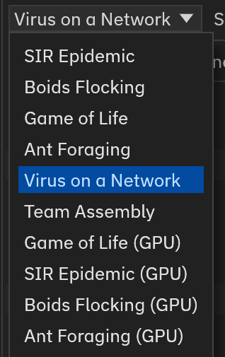{ width="240" }
<figcaption>The ten default Henad models.</figcaption>
</figure>

Use the dropdown to pick a model.
Picking a model also loads its default parameters, discarding parameters set in <span class="ui" markdown>:material-tune: Parameters</span> tab.

The GPU model entries only appear when a suitable device is detected.

See the [models reference](../reference/models.md) for more details on each model.

### Metadata

Below the description, the panel displays auto-computed metadata about the model, which is useful for understanding its structure and resource requirements.

<figure markdown="span">
  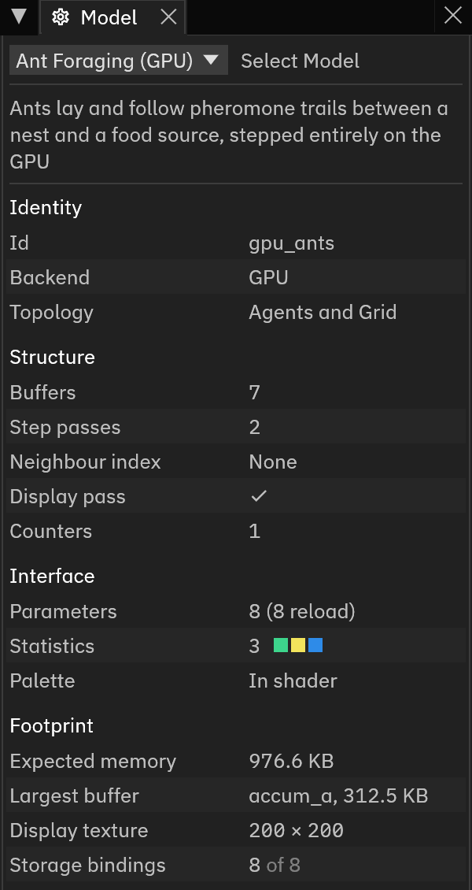{ width="300" }
<figcaption>Model metadata for Ant Foraging (GPU).</figcaption>
</figure>

Identity
: The model id the [CLI](../reference/cli.md) takes, its backend (CPU or GPU), and which display layers it publishes.
  A network model's topology reads Network.

Structure
: Underlying data structure of the model, which is different for each [authoring trait](../authoring/index.md).
  For example, a grid model reports its neighbourhood; a CPU agent model its lanes, chunk size, neighbour index and field layer; a GPU model its buffers and passes.
  A network model reports its lanes and its chunk size.
  Hover over the counts to see the names of each buffer or step pass.

Interface
: How many parameters and [statistics](../authoring/statistics.md) the model declares, and the palette it uses.
  Palette information cannot be obtained directly for a GPU model.
  A network model adds an **Edge palette** row with the colours its edges can take.

Footprint (GPU only)
: Expected model resource requirements at the parameter values currently in the <span class="ui" markdown>:material-tune: Parameters</span> tab.

## :material-tune: Parameters tab

This tab shows the parameters of the selected model, and you can change them using the sliders or text boxes.
A parameter that is either on or off shows as a checkbox, and one with a fixed set of options shows as a dropdown.
Some parameters, such as chances, are shown as percentages, and you can type a value with or without the `%` sign.

<figure markdown="span">
  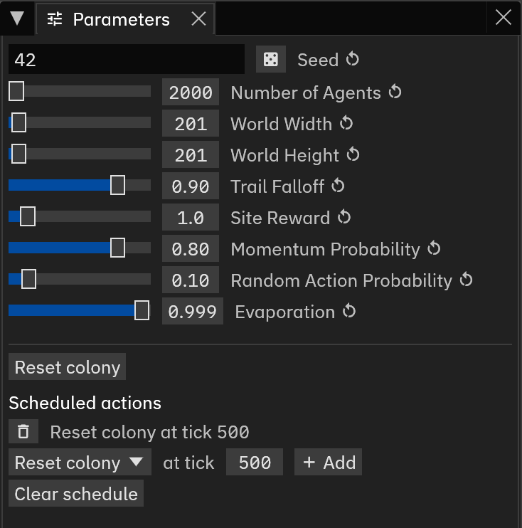{ width="370" }
<figcaption>Parameters for the Ant Foraging model on the GPU.</figcaption>
</figure>

A parameter can either be **live** or **reload**.

Live
: Takes effect on the next tick. This means that you can change it while the simulation is running, and see the effect immediately.

Reload
: Only read when the model is (re)built. They always carry a :material-restart: marker.
  Editing a reload parameter while a simulation is running will turn the label amber, with a **:material-alert: Reload needed** banner.
  Nothing is lost, and nothing is applied until you press <span class="ui" markdown>:material-restart: Build</span>.

<figure markdown="span">
  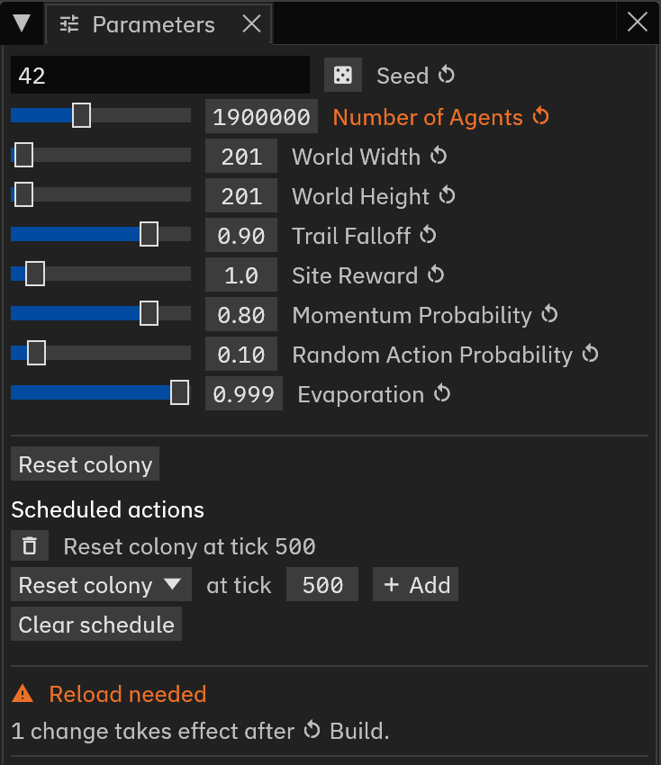{ width="370" }
<figcaption>Editing a reload parameter while a simulation is running.</figcaption>
</figure>

There are 4 possible banners:

| Banner                                      | Meaning                                                                                |
| ------------------------------------------- | -------------------------------------------------------------------------------------- |
| :material-information: No simulation loaded | Nothing built yet. Parameters apply on the first build.                                |
| :material-alert: Selected model not loaded  | A model different from the running one is selected.                                    |
| :material-alert: Reload needed              | Reload parameters, the seed or the scheduled actions have been edited but not applied. |
| :material-alert: Too large for this device  | The selected parameters require too much resources. Try lowering them.                 |

### Seed

Most models draw random numbers, and the **Seed** field at the top of the tab picks the seed they start from.
Left empty, the field reads **Default**, and the model builds with its own seed.
Type an integer from 0 to 18446744073709551615 to build with that seed instead, or press <span class="ui" markdown>:material-dice-5:</span> to fill in a random one.
Any other text shows an error under the field, and <span class="ui" markdown>:material-restart: Build</span> stays disabled until you fix it.

The seed is only read when the model is built, like a reload parameter, and carries the same :material-restart: marker.
Changing it turns the label amber and counts towards the **Reload needed** banner.
The dice button only fills in the field, and the new seed applies on the next build.

A seed makes a run repeatable.
Two builds with the same seed, parameters and [scheduled actions](#scheduled-actions) step through the same run, tick for tick.
Playback speed and thread count make no difference.
A rebuild reads the values in the <span class="ui" markdown>:material-tune: Parameters</span> tab, so a live parameter edit applies from tick 0 instead of the tick it was made at.
A press of an action button is not repeated.

The seed means the same thing to the [CLI](../reference/cli.md).
A number in the field is the number `henad-cli --seed` takes, and **Default** matches `henad-cli` without `--seed`.
For example, record 100 ticks of SIR with seed 42:

``` bash
cargo run --release -p henad-cli -- sir --seed 42 --steps 100 --export-stats sir.csv
```

Then select SIR, type 42 into the **Seed** field, press <span class="ui" markdown>:material-restart: Build</span>, and [run to tick](#run-to-tick) 100.
The <span class="ui" markdown>:material-table: Statistics</span> tab shows the same values as the row for tick 100 in `sir.csv`.

GPU Boids is the one model whose runs do not repeat.
Its neighbour index leaves the order of the boids within a cell open, and two builds with one seed drift apart after tick 0.

### Actions

Some models declare actions, one-off changes to the state, such as **Randomise** and **Clear** in Game of Life or **Rewire a link** in Virus on a Network.
Each action gets a button below the parameters.
Pressing it runs the action once, between ticks, and it also works while the simulation is paused.
The buttons are disabled until the selected model is built.

### Scheduled actions

A button runs its action in the current run only.
To run an action at a set tick on every build, add it to **Scheduled actions**, below the buttons.
Pick the action in the dropdown, set the tick in the field after **at tick**, and press <span class="ui" markdown>:material-plus: Add</span>.
The list is kept in tick order, and each entry reads like **Seed outbreak at tick 10**.
<span class="ui" markdown>:material-delete-outline:</span> removes one entry, and <span class="ui" markdown>Clear schedule</span> removes them all.

Each action runs once, after the step that reaches its tick, and one at tick 0 runs as soon as the model is built.
The <span class="ui" markdown>:material-table: Statistics</span> tab already shows the action's effect at that tick.
With the same seed, a scheduled **Seed outbreak at tick 10** gives the same run as `henad-cli --act seed_outbreak@10`.
The row `--export-stats` writes for tick 10 includes the action too.

The list is read when the model is built, as the seed is.
Changing it turns the heading amber and counts towards the **Reload needed** banner.
Picking another model in the <span class="ui" markdown>:material-cog-outline: Model</span> tab clears the list.

## :material-play-circle-outline: Playback tab

<figure markdown="span">
  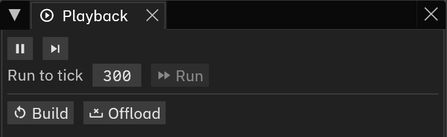{ width="370" }
<figcaption>Playback tab while a simulation is running.</figcaption>
</figure>

<span class="ui" markdown>:material-play:</span> / <span class="ui" markdown>:material-pause:</span>
: Start or pause the simulation.

<span class="ui" markdown>:material-skip-next:</span>
: Advance one tick while paused.

**Run to tick** and <span class="ui" markdown>:material-fast-forward: Run</span>
: Step as fast as possible to a tick, then pause. See [below](#run-to-tick).

<span class="ui" markdown>:material-restart: Build</span>
: Construct the selected model from the current parameters, replacing the running simulation if it exists.

<span class="ui" markdown>:material-tray-remove: Offload</span>
: Remove the simulation from memory and free its resources. This also terminates the running simulation if it exists.

### Run to tick

Type a tick into the **Run to tick** field and press <span class="ui" markdown>:material-fast-forward: Run</span>.
The simulation steps as fast as it can until it reaches that tick, then pauses.
**Target TPS** in the <span class="ui" markdown>:material-speedometer: Pacing</span> tab does not slow it down.
While it runs, the row turns into a progress bar reading **Running to tick** and the target.
The viewport and statistics refresh about ten times a second.
After Run to tick, the <span class="ui" markdown>:material-chart-line: Charts</span> tab holds only the snapshots the app received on the way, so a fast run can draw as a straight line.

<span class="ui" markdown>Cancel</span> stops the run at the current tick.
Pressing <span class="ui" markdown>:material-play:</span> or <span class="ui" markdown>:material-skip-next:</span> also ends it, and <span class="ui" markdown>:material-play:</span> carries on at the paced speed.

A tick behind the current one rebuilds the model first and runs to the tick from 0.
The rebuild reads the <span class="ui" markdown>:material-tune: Parameters</span> tab as <span class="ui" markdown>:material-restart: Build</span> does, so any change waiting for a build applies too.

When the run stops, the <span class="ui" markdown>:material-table: Statistics</span> tab shows the stats of that exact tick, on a GPU model too.

<span class="ui" markdown>:material-fast-forward: Run</span> is disabled in four cases:

- no model is built yet;
- the simulation is playing, until you pause it;
- the <span class="ui" markdown>:material-cog-outline: Model</span> tab has a model selected other than the one loaded, until you press <span class="ui" markdown>:material-restart: Build</span>;
- the tick is behind the current one and <span class="ui" markdown>:material-restart: Build</span> is disabled, for example while the **Seed** field shows an error.

## :material-speedometer: Pacing tab

The <span class="ui" markdown>:material-speedometer: Pacing</span> tab controls how fast the simulation runs.
The controls for CPU and GPU models are different due to the different ways they run.

=== "CPU model"

    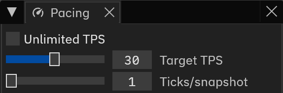{ width="370" }

    **Unlimited TPS** removes the speed cap and lets the sim thread run as fast as it can.
    This is generally favorable as it delivers results quickly, but it can be difficult to see the visualization clearly at this speed.

    **Target TPS** sets the maximum ticks per second.

    **Ticks/snapshot** sets how many ticks pass between published snapshots.
    This controls how frequently the viewport and the statistics are updated.

    When a network model is loaded, three layout controls follow.

    **Layout** arranges the nodes with a spring layout while the simulation runs, and is on by default.
    Node positions are only for drawing, and the layout never changes the statistics.

    **Layout while paused** keeps the layout running while the simulation is paused.
    Without it, pausing freezes the picture.

    **Layout budget** sets the time the layout spends on each snapshot.
    The layout always runs at least one iteration, and on a large network one iteration can take longer than the budget.
    The layout shares time with the simulation, so a larger budget moves the layout further per snapshot but leaves less time for ticks.
    The **Prepare view** row in the <span class="ui" markdown>:material-gauge: Performance</span> tab includes the time the layout took.

    **Layout while paused** and **Layout budget** can only be changed while **Layout** is on.

=== "GPU model"

    The GPU is also needed to render the UI, so more complex pacing controls is required.

    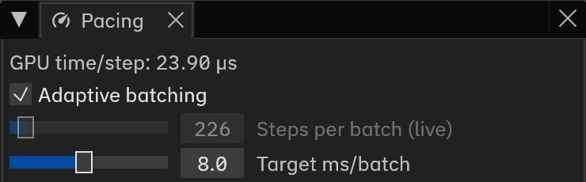{ width="370" }

    **GPU time/step** is the time the GPU spent on the last tick.

    **Adaptive batching** automatically calculates how many steps should the GPU run each batch, aiming to keep each batch under **Target ms/batch**.

    **Target ms/batch** sets the maximum time the GPU should spend on each batch. This affects FPS of the UI.

    **Steps per batch** sets how many steps the GPU runs each batch.
    This is analogous to **Ticks/snapshot** for CPU models.

## :material-cube-outline: Viewport tab

<figure markdown="span">
  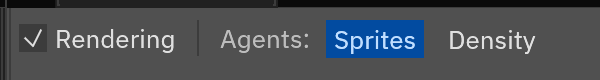{ width="330" }
</figure>

**Rendering** turns drawing off without stopping the simulation.

**Agents** controls agent model's rendering mode, either as individual sprites or as a density heatmap.

=== "Sprites"

    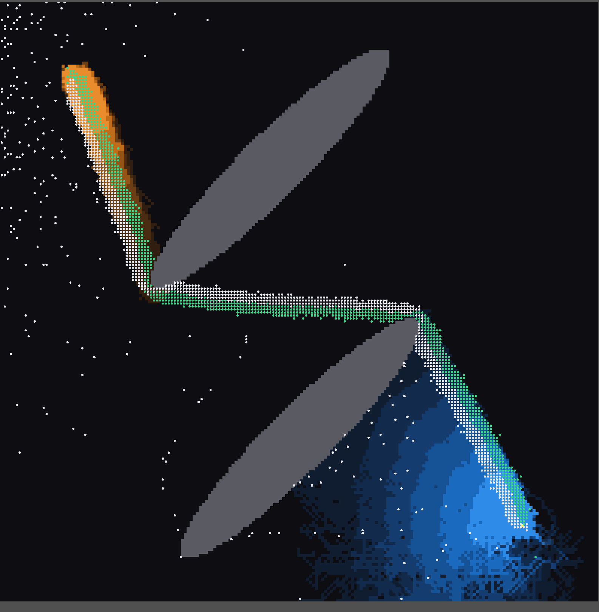{ width="620" }

=== "Density"

    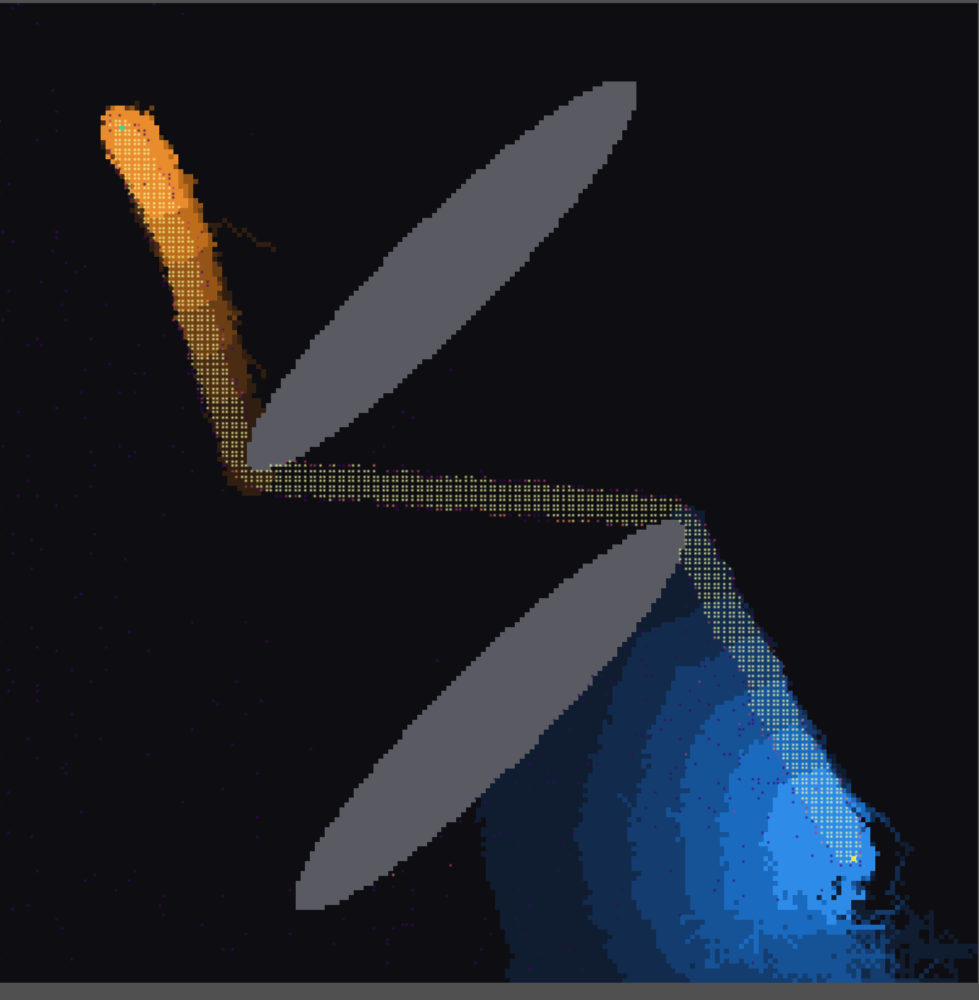{ width="620" }

A model with both a [field](../authoring/fields.md) and a population draws the field first and the agents over the top.

In **Sprites** mode, on a GPU that can draw edges, a network model adds two more checkboxes.
**Edges** draws the edges between the nodes, under the nodes themselves.
**Arrows** appears once **Edges** is ticked, and puts an arrowhead at the target end of each edge.
It can only be ticked when the model's edges are directed.
Without arrowheads, a directed edge fades towards its source.

A node the model has retired, such as a Team Assembly member left too long without a team, is hidden, and its edges are removed with it.

## :material-table: Statistics tab

<figure markdown="span">
  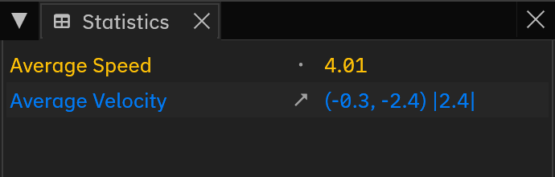{ width="420" }
<figcaption>Each stat is drawn in the colour the model declared for it.</figcaption>
</figure>

Models can register [statistics](../authoring/statistics.md) to be published every tick.
The latest values are shown in the <span class="ui" markdown>:material-table: Statistics</span> tab, and the historical data are plotted in the <span class="ui" markdown>:material-chart-line: Charts</span> tab.

There are three types of statistics available:

| Icon                                                | Kind      | Shown as                            |
| --------------------------------------------------- | --------- | ----------------------------------- |
| :material-circle-small:{ title="Scalar" }           | Scalar    | A number, with up to three decimals |
| :material-arrow-top-right-thin:{ title="Vector2D" } | Vector2D  | `(x, y)` and its magnitude          |
| :material-chart-histogram:{ title="Histogram" }     | Histogram | `n=` the total count across bins    |

## :material-chart-line: Charts tab

<figure markdown="span">
  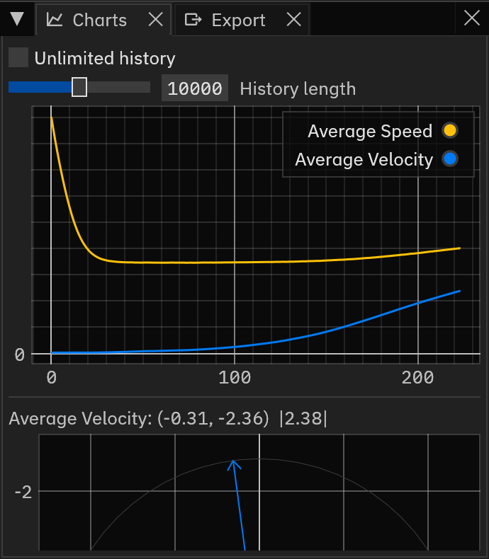{ width="420" }
<figcaption>The charts panel shows the historical data for each stat.</figcaption>
</figure>

Every stat contributes a line to one time series, plotted against tick.
Each non-scalar stat are also plotted for the latest snapshot: an arrow from the origin for a vector, with a circle at its current magnitude, and a bar chart for a histogram.

The charts are powered by [egui_plot](https://github.com/emilk/egui_plot).
Drag to pan, scroll to zoom, and click a legend entry to show/hide that series.

**History length** sets how many snapshots are kept.
Shrinking it deletes the oldest samples.

Tick **Unlimited history** to keep every snapshot instead, which can be helpful for [exporting](#export-tab).
Be aware that memory usage will increase as a result.
Check <span class="ui" markdown>:material-gauge: Performance</span> tab frequently to ensure Henad is not accidentally using too much memory.

## :material-application-export: Export tab

The <span class="ui" markdown>:material-application-export: Export</span> tab writes relavent results to files.

### Statistics

<span class="ui" markdown>:material-tray-arrow-down: Save stats</span> writes the recorded history as CSV, one row per snapshot and one column per stat series.
A vector stat becomes three columns, `.x`, `.y` and `.magnitude`; a histogram becomes one column per bucket plus `.total`.

If Unlimited history is not enabled, a warning will be displayed as oldest snapshots might have been lost over time.
Turn on **Unlimited history** in the <span class="ui" markdown>:material-chart-line: Charts</span> tab to keep every snapshot.

### Recording

<span class="ui" markdown>:material-record-circle-outline: Record</span> captures every snapshot from the moment it starts, independent of the history length setting in the <span class="ui" markdown>:material-chart-line: Charts</span> tab.

<span class="ui" markdown>:material-stop: Stop</span> will stop recording, and <span class="ui" markdown>:material-tray-arrow-down: Save recording</span> will write the captured snapshots to CSV.

### Current state

<span class="ui" markdown>:material-tray-arrow-down: Save state</span> writes the current cells and agent positions as text, the same format as `henad-cli --export`.
For a network model it also writes the edges, giving each endpoint as that node's row in the file, and leaves retired nodes out.
Due to technical limitations, the current state of a GPU model cannot be exported.

### Viewport

<span class="ui" markdown>:material-tray-arrow-down: Save image</span> writes the layers as a PNG at a specific resolution automatically determined by the engine.
A network's edges are drawn as the **Edges** and **Arrows** checkboxes in the <span class="ui" markdown>:material-cube-outline: Viewport</span> tab have them.

### Run details

<span class="ui" markdown>:material-tray-arrow-down: Save details</span> writes a JSON file about running metadata, including the model, its resolved parameters, the tick reached, and the host and adapter and more entries.

`seed` is the seed the model was built with, or `null` for **Default**, and `scheduled_actions` lists the `id` and `tick` of each scheduled action.
`params` holds the values in the <span class="ui" markdown>:material-tune: Parameters</span> tab when the file is saved, and `params_match_running_model` is `false` while another model is selected or a parameter waits for a build.
When it is `true` and nothing changed during the run, `henad-cli` repeats the run from these fields: each parameter as a `--set`, the seed as `--seed` (left out when `null`), each scheduled action as `--act ID@TICK`, and `tick` as `--steps`.
The file does not record a live parameter edit or a press of an action button.

## :material-flask-outline: Sweep tab

The <span class="ui" markdown>:material-flask-outline: Sweep</span> tab runs a [parameter sweep](sweeps.md): many runs of the model selected in the <span class="ui" markdown>:material-cog-outline: Model</span> tab, over several parameter values and seeds.
It sits behind the <span class="ui" markdown>:material-cube-outline: Viewport</span> tab, together with <span class="ui" markdown>:material-chart-box-outline: Results</span>.
A sweep started here writes the same four files as `henad-cli --out`.
The [parameter sweeps guide](sweeps.md) covers each setting in more depth.

<figure markdown="span">
  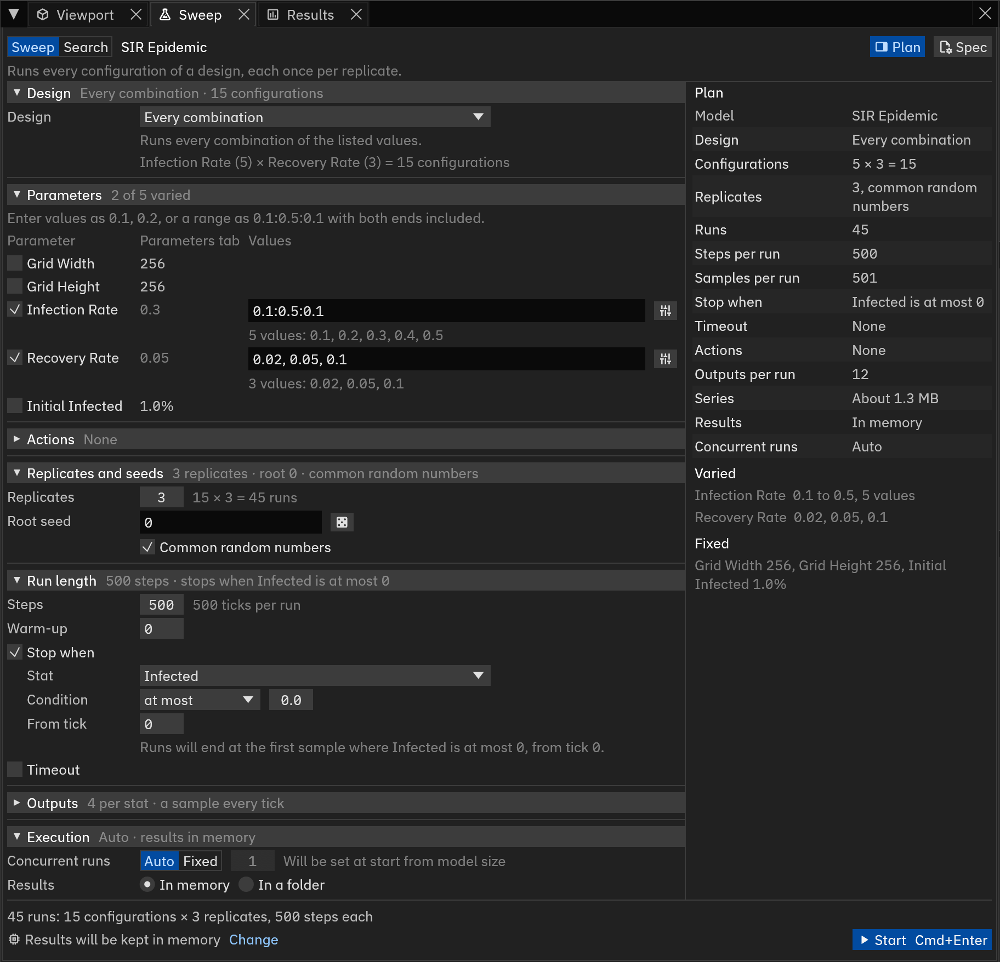{ width="700" }
<figcaption>A sweep of SIR Epidemic over 15 configurations, with 3 replicates of each.</figcaption>
</figure>

The top of the tab holds **Sweep** and **Search**, the model's name, <span class="ui" markdown>:material-dock-right: Plan</span> and the <span class="ui" markdown>:material-file-cog-outline: Spec</span> menu.
**Sweep** runs every configuration of a design, and **Search** runs a [search](search.md) that picks its configurations as it goes.
The line under them describes the mode.
After a save or a load it reports the outcome instead, as in **Saved henad-sir-sweep.toml**, until you change a setting, press <span class="ui" markdown>:material-close:</span> or switch the mode.
The model's name brings the <span class="ui" markdown>:material-cog-outline: Model</span> tab to the front, where another model can be picked.
The bottom of the tab holds the total of the runs and <span class="ui" markdown>:material-play: Start</span>, and neither scrolls away.

The settings between them sit in sections: **Design**, **Parameters**, **Actions**, **Replicates and seeds**, **Run length**, **Outputs** and **Execution**.
**Actions** appears only for a model that declares actions.
A section's header sums up its settings after the title, as in **1000 steps · stops when Infected is at most 0** for **Run length**, and a click on the header opens or closes the section.
**Outputs** and **Execution** start closed.
A section with a problem counts it beside its title, and a closed section shows the count too.
On a wide tab, the [Plan](#plan) panel on the right lists the totals of the sweep.
On a narrow tab, each label sits above its control, and the plan becomes the last section.

The sections below describe a sweep, and [Search mode](#search-mode) covers the changes for a search.

### Design

**Design** sets how the values of the varied parameters combine into configurations.
The lines under it say what the design runs and how it counts the configurations, as in **Infection Rate (5) × Recovery Rate (3) = 15 configurations**.

Every combination
: Runs every combination of the values, as repeated `--vary` does.

Zip
: Pairs the first values of every parameter, then the second, and so on, as `--zip` does.
  Each varied parameter needs the same number of values, and the line under **Design** names each list's length when they differ.

One at a time
: Varies one parameter at a time, and holds the others at their values in the <span class="ui" markdown>:material-tune: Parameters</span> tab.
  Three parameters at five values each give 15 configurations, against 125 for **Every combination**.
  A varied action tick takes its turn too, with every parameter at its <span class="ui" markdown>:material-tune: Parameters</span> tab value.
  Each varied parameter or action tick becomes a [block](sweeps.md#blocks) of its own in the spec.

Latin hypercube, Uniform random
: Draw **Samples** configurations from the ranges, as `--sample lhs:N` and `--sample random:N` do.
  **Design seed**, under **Replicates and seeds**, fixes the draws, and <span class="ui" markdown>:material-dice-5:</span> fills in a random one.
  Left empty, the design seed is derived from the root seed.

Design table
: Runs the rows of a CSV file as configurations, as `--design` does.
  Press <span class="ui" markdown>:material-file-delimited-outline: Load design CSV</span> to pick the file, <span class="ui" markdown>Replace</span> to pick another, and <span class="ui" markdown>Remove</span> to drop it.
  The row names the file and counts its rows, as in **sir-design.csv · 12 rows**.
  The line under the file names the parameters its columns set, and every other parameter keeps its <span class="ui" markdown>:material-tune: Parameters</span> tab value.

### Parameters to vary

**Parameters** lists every parameter of the model, under a line that gives the text its values take in the design picked.
Tick one to vary it, and type its values into the field beside it.
The field takes values the way `henad-cli --vary` does:

| Text            | Values                                                             |
| --------------- | ------------------------------------------------------------------ |
| `0.1, 0.2, 0.5` | Each listed value                                                  |
| `0.1:0.5:0.1`   | 0.1 to 0.5 in steps of 0.1, both ends included                     |
| `0.1:0.5`       | Every value between 0.1 and 0.5, for a sampled design to draw from |
| `all`           | Every option of a checkbox or a dropdown                           |

The line under the field lists the values, as in **5 values: 0.1, 0.2, 0.3, 0.4, 0.5**, and shows the first three and the last of a longer list.
A newly ticked field starts empty, and its line reads **Enter values** with an example, as in **Enter values, such as 0:1:0.2**.

<span class="ui" markdown>:material-tune-vertical:</span> beside the field opens an editor of the same text.
In the editor, **Values**, **Range** and **Range to draw from** pick a list, a range from **Minimum** to **Maximum** a **Step** apart, or a whole range for the design to draw from.
Only **Latin hypercube** and **Uniform random** enable **Range to draw from**.
<span class="ui" markdown>Whole range</span>, <span class="ui" markdown>Both ends</span>, <span class="ui" markdown>Around current</span> and <span class="ui" markdown>Current value</span> fill in the whole range, its two ends, half, one and one and a half times the parameter's value in the <span class="ui" markdown>:material-tune: Parameters</span> tab, or that value alone.
The editor writes into the field as you edit.
A checkbox or dropdown parameter takes a menu of its options in place of the field, and writes `all` or the options ticked.
The menu's button reads **All options**, or names the options ticked.

On a wide tab, a **Parameters tab** column shows each parameter's value in the <span class="ui" markdown>:material-tune: Parameters</span> tab.
An unticked parameter keeps that value, and on a narrower tab its row shows it, as in **at 0.3**.
With a design table, the table's columns set their parameters, and the checkboxes give way to the names.
A parameter the table sets carries :material-table-column: and reads **From design table**.

### Actions, replicates and run length

**Actions** fires one of the model's actions in every run.
Press <span class="ui" markdown>:material-plus: Add action</span>, pick the action in the **Action** dropdown and set its **Tick**.
Tick **Vary tick** to try the action at several ticks, typed into the field that takes the tick's place, as a parameter's values are.
<span class="ui" markdown>:material-delete-outline:</span> removes the action.
An action fires after the step that reaches its tick, as a [scheduled action](#scheduled-actions) does.
An action due past the last tick of a run shows a warning, since it never fires there.

**Replicates** runs each configuration that many times, each time with a seed of its own, and the line beside it counts the runs, as in **15 × 3 = 45 runs**.
Every seed is derived from **Root seed**, and <span class="ui" markdown>:material-dice-5:</span> fills in a random root.
With **Common random numbers** ticked, replicate `r` starts from the same seed in every configuration, and less of the difference between two configurations is noise.
Untick it to give every run a seed of its own, as `--independent-seeds` does.
The sweeps guide explains the [seed scheme](sweeps.md#replicates-and-seeds).

**Steps** is the number of ticks each run measures, after **Warm-up** ticks that the outputs skip.
The line beside **Steps** counts both, as in **1100 ticks per run**.

Tick **Stop when** to end a run at the first sample where a stat passes a threshold, as `--stop` does.
Pick the **Stat**, the comparison and the threshold under **Condition**, and set **From tick** to the first tick at which the condition can end a run.
The comparison's dropdown gives each comparison in words, then its symbol: **below** `<`, **at most** `<=`, **equal to** `=`, **not equal to** `!=`, **at least** `>=` and **above** `>`.
The line under them spells the condition out, as in **Runs will end at the first sample where Infected is at most 0, from tick 0.**
Tick **Timeout** to end a run once it has stepped for **Seconds per run**, 600 to begin with.
The ticks a run reaches in that time depend on the machine, and a sweep with a timed-out run is not reproducible.

### Outputs and execution

**Sample every** sets how often a run reads its stats, and **Series every** how often a sample goes into the series.
**Series every** has to be a multiple of **Sample every**, and 0 keeps no series at all.
Reading stats takes time, most of all on the GPU, and a larger **Sample every** makes a sweep faster.
The lines beside them count the samples of a run and the size of the series.

**Final value, minimum, maximum and mean of every stat** records those four values of every stat for each run.
<span class="ui" markdown>:material-plus: Add output</span> records one more value of a stat, picked in the row's two dropdowns.
The choices are **Final value**, **Minimum**, **Maximum**, **Mean**, **Tick of maximum**, **Tick of minimum**, **First tick crossing** a threshold, and **Mean over window** between two ticks.
The line under the row names its column in `runs.csv`, as in **Written as Susceptible:argmax**.
The sweeps guide describes each as a [reducer](sweeps.md#measuring-a-run).

**Concurrent runs** sets how many runs step at once.
**Auto** picks a number from the size of the model when the sweep starts, as `henad-cli` does, and **Fixed** steps the number beside it.
Each run in progress holds its own memory, and a large model runs fastest alone.

**Results** keeps the results **In memory** until you save them, or writes them **In a folder** as the runs finish, as `--out` does.
Picking **In a folder** opens a dialog to pick the folder, and the **Folder** field then holds its path.
Canceling the dialog leaves the results in memory, and <span class="ui" markdown>:material-folder-outline: Select</span> picks another folder later.
The folder must not hold results already, and <span class="ui" markdown>:material-play: Start</span> stays disabled while it does.
When those results are incomplete, <span class="ui" markdown>Open in Results</span> opens them in the <span class="ui" markdown>:material-chart-box-outline: Results</span> tab, where <span class="ui" markdown>:material-play: Resume sweep</span> finishes them.

### Plan

On a wide tab, the **Plan** panel beside the settings sums up the sweep as it stands.
Its rows give the totals and the settings that shape the runs, such as **Configurations** reading **5 × 3 = 15** and **Series** reading **About 1.6 MB**.
A total reads **Unknown** while any problem remains.
**Runs** and **Series** turn orange from half the app's [limits](#starting-a-sweep).
Under the rows, **Varied** lists the values of each varied parameter or action tick, and **Fixed** gives the value of every other parameter.
**Problems** and **Warnings** follow when the sweep has any.
A click on a row's label opens the section that sets it, and a click on a problem opens its row.

<span class="ui" markdown>:material-dock-right: Plan</span> at the top of the tab shows or hides the panel, and dragging its left edge resizes it.
On a narrow tab, the panel and its button give way to a **Plan** section at the end of the settings, closed until you open it.

### Starting a sweep

The bottom of the tab counts the runs, as in **45 runs: 15 configurations × 3 replicates, 1100 steps each**.
While the sweep has a problem, the line names the first one instead, as in **Sweep not ready. Recovery Rate: '0.x' is not a number**, and each problem also shows under its row.
Input still to give, such as a ticked parameter with no values, reads in the normal text colour with :material-pencil-outline:.
Input the sweep refuses reads in red with :material-alert:.
While you type in a field, its line shows the form the text takes, as in **Format: 0.1, 0.2 or min:max:step**, and the problem shows once you leave the field or stop typing.

At the end of that line, a count reads **2 problems**, or **2 missing** while every problem is input still to give.
A click on the count lists the problems under **Sweep not ready**, and a click on one opens its section and selects the row's text.
A count such as **1 warning** lists the warnings in the same way, and a warning never stops a sweep from starting.
<span class="ui" markdown>:material-play: Start</span> stays disabled until every problem is fixed, and its tooltip lists the first three.
When a sweep cannot start, the reason takes the place of the count of runs.

The line under it says where the results go, as in **Results will be kept in memory**, and **Change** opens the **Execution** section.
The app runs sweeps of up to 1,048,576 runs, and a larger one needs `henad-cli`.
A sweep that keeps its results in memory holds up to about 4 GB of series, or 1 GB in a browser.
A larger one needs its results **In a folder** or a larger **Series every**.
From half of either limit, the count of runs turns orange.

Press <span class="ui" markdown>:material-play: Start</span>, or ++cmd+enter++ (++ctrl+enter++ outside macOS), to run the sweep.
Starting a sweep pauses the live simulation.
You can press <span class="ui" markdown>:material-play:</span> in the <span class="ui" markdown>:material-play-circle-outline: Playback</span> tab again, and the simulation and the sweep then share the processor.
When the <span class="ui" markdown>:material-chart-box-outline: Results</span> tab holds results in memory that you have not saved, the bottom of the tab reads **Last results not saved** beside <span class="ui" markdown>:material-tray-arrow-down: Save results</span>.
Starting a sweep then opens a **Replace results?** dialog first.
<span class="ui" markdown>Save results</span> there saves them and starts nothing, and <span class="ui" markdown>Start anyway</span> drops them.

### While a sweep runs

<figure markdown="span">
  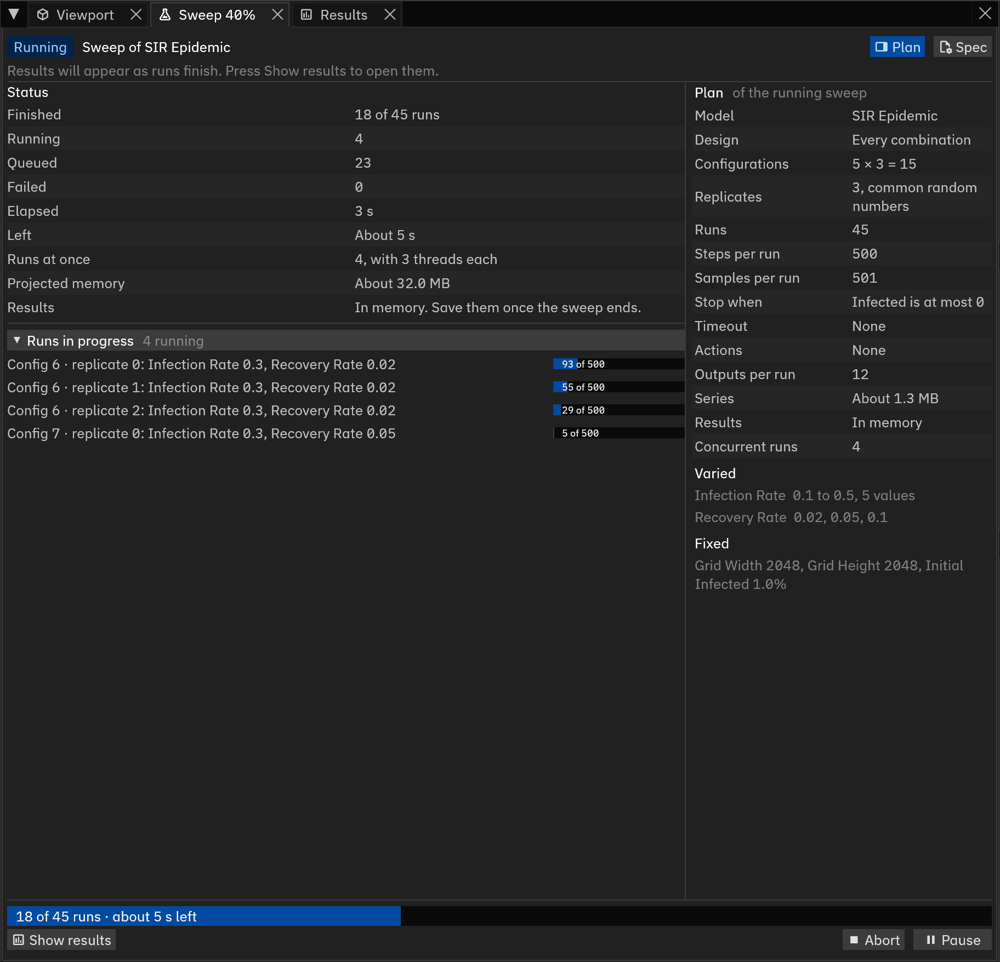{ width="700" }
<figcaption>The sweep above on a 2048 by 2048 grid, four runs at a time.</figcaption>
</figure>

Once the sweep starts, its progress takes the place of the settings, and <span class="ui" markdown>:material-pause: Pause</span> takes the place of <span class="ui" markdown>:material-play: Start</span>.
The top of the tab names the sweep, as in **Sweep of SIR Epidemic**, beside its state: **Planning**, **Running**, **Paused** or **Paused after GPU error**.
The tab's title shows the share of the runs finished, as in **Sweep 20%**, or **Sweep paused** while the sweep is paused.
The progress then stays in view behind another tab.

The bottom of the tab shows a bar of the finished runs, as in **12 of 60 runs · 1 failed · about 16 s left**.
The estimate assumes the remaining runs take as long as the finished ones did.
Above the bar, the **Status** grid counts the finished, running, queued and failed runs, the time elapsed and left, the runs stepped at once and the memory they are projected to hold.
Its last row, **Results**, says where the results go.
**Runs in progress** lists each run with the values of its configuration and a bar of its ticks, as in **Config 3 · replicate 1: Infection Rate 0.2, Recovery Rate 0.05** beside **420 of 1000**.
It lists eight runs at most, and counts the rest.
The Plan panel shows the plan of the running sweep, and a narrow tab shows it in a closed **Plan** section at the bottom.
The <span class="ui" markdown>:material-chart-box-outline: Results</span> tab fills in as the runs finish, and <span class="ui" markdown>:material-chart-box-outline: Show results</span> brings it to the front.

<span class="ui" markdown>:material-pause: Pause</span>
: Holds every run in progress after its current slice of steps.
  The runs keep their state, and <span class="ui" markdown>:material-play: Resume</span> carries them on from where they stopped.
  While the sweep is paused, the bar turns orange and the estimate is hidden.

<span class="ui" markdown>:material-stop: Abort</span>
: Ends the sweep, once you confirm with <span class="ui" markdown>Abort sweep</span> in the **Abort sweep?** dialog.
  Finished runs stay in the results, and runs in progress are dropped.
  With several runs at once, a run that finishes before an earlier one waits for it to be written, and an abort drops it too.
  The dialog counts the runs it keeps and each kind it drops, and says whether the rest can run later.
  <span class="ui" markdown>Keep running</span>, or <span class="ui" markdown>Keep paused</span> for a paused sweep, closes it and leaves the sweep as it was.

A run that fails, for example when its model panics, is recorded with its status, and the sweep carries on with the next run.
<span class="ui" markdown>Show failed runs</span> beside the **Failed** count lists the failed runs in the **Runs** view of the Results tab.
On a GPU model, a device error that no run can be tied to pauses the sweep, and the top of the tab reads **Paused after GPU error**.
Closing the app aborts a running sweep.
An aborted sweep with an output folder keeps the runs it wrote, and <span class="ui" markdown>:material-play: Resume sweep</span> in the [Results tab](#opening-results) finishes it later.

### When a sweep ends

The bar then stops, and reads like **Sweep finished: 15 runs, 0 failed, in 4 s**, or **Sweep aborted after 39 of 300 runs, in 12 s**.
The time leaves out pauses.
The state at the top of the tab reads **Finished**, **Aborted**, **Stopped** after the GPU device is lost, or **Failed**.
The tab's title reads **Sweep done**, **Sweep stopped** or **Sweep failed**.
A **Result** grid takes the place of **Status**, with the runs written, the failed runs, the time and where the results are.
Under an aborted sweep, a line says whether the runs it did not write can run later.
Under the bar, <span class="ui" markdown>:material-pencil-outline: Edit sweep</span> sits on the left, and <span class="ui" markdown>:material-tray-arrow-down: Save results</span> and <span class="ui" markdown>:material-chart-box-outline: Show results</span> on the right.

<span class="ui" markdown>:material-pencil-outline: Edit sweep</span>
: Returns to the settings of the sweep, ready to change and start again.
  When another model was picked in the <span class="ui" markdown>:material-cog-outline: Model</span> tab meanwhile, the sweep's model is selected again, with the values the sweep held fixed.
  The results stay in the <span class="ui" markdown>:material-chart-box-outline: Results</span> tab.
  After a sweep resumed from the Results tab, the button reads <span class="ui" markdown>New sweep</span>.

<span class="ui" markdown>:material-tray-arrow-down: Save results</span>
: Saves the four files of a sweep held in memory: `runs.csv`, `series.csv`, `summary.csv` and `manifest.json`.
  The desktop app asks for a folder, and refuses one that already holds a file of the same name.
  A browser downloads the files one after another.
  The button goes once the files are saved.
  A sweep with an output folder wrote its files as it ran, and has no such button.

<span class="ui" markdown>:material-chart-box-outline: Show results</span>
: Brings the <span class="ui" markdown>:material-chart-box-outline: Results</span> tab to the front.

### Spec files

<span class="ui" markdown>:material-tray-arrow-down: Save spec</span> in the <span class="ui" markdown>:material-file-cog-outline: Spec</span> menu saves the sweep as a TOML [spec file](sweeps.md#spec-files), named like `henad-sir-sweep.toml`.
The file holds every setting that changes a result, each parameter the sweep does not vary at its value in the <span class="ui" markdown>:material-tune: Parameters</span> tab, and **Concurrent runs**.
It leaves out where the results go.
`henad-cli --spec FILE --out DIR` runs the same sweep from the command line.
When a setting cannot go into a spec, such as a value that is not a number, the save fails and the top of the tab reads **Spec save failed** with the reasons.
The first row at fault then opens.
While a sweep runs, and after it ends, <span class="ui" markdown>:material-tray-arrow-down: Save spec</span> saves the spec that started it.
For a sweep resumed from the Results tab it is disabled, since the folder's `manifest.json` holds the spec.

<span class="ui" markdown>:material-tray-arrow-up: Load spec</span> reads a spec file back.
It selects the model the spec names, puts the spec's fixed values into the <span class="ui" markdown>:material-tune: Parameters</span> tab, and fills in the Sweep tab, with the results **In memory**.
The tab edits a spec with one block, or with the blocks **One at a time** writes.
A spec with any other blocks, such as `crates/henad-explore/specs/sir_sweep.toml`, runs from the command line only.
A spec with a `[search]` table opens in Search mode.
<span class="ui" markdown>:material-tray-arrow-up: Load spec</span> is disabled from the start of a sweep until <span class="ui" markdown>:material-pencil-outline: Edit sweep</span> returns to the settings.

### Search mode

<figure markdown="span">
  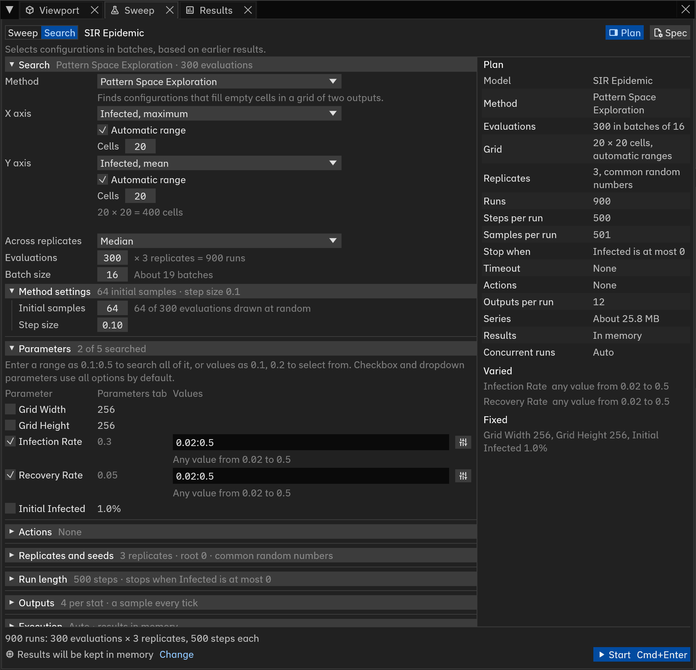{ width="700" }
<figcaption>A Pattern Space Exploration over the peak and the mean of Infected, each axis with an automatic range.</figcaption>
</figure>

In **Search** mode, **Parameters** picks the factors of the [search space](search.md#the-search-space).
Tick a parameter to search over it.
Its field starts at the parameter's whole range, as in `0:1`, or at `all` for a checkbox or a dropdown.
The field takes the same text as in a sweep, and a range with no step reads as in **Any value from 0 to 1**.
The search selects from listed values, as in **3 values to select from: 0.1, 0.2, 0.5**, and the values editor offers **Range to search** in place of **Range to draw from**.
In **Actions**, tick **Search tick** to let the search pick an action's tick from the range typed beside it.

A **Search** section takes the place of **Design**.
**Method** picks **Random search**, **Hill climbing**, **Genetic algorithm** or **Pattern Space Exploration**, and the line under it says what the method does.
The tab keeps the settings of every method, and switching between them loses none.
**Objective** picks the output that scores each configuration, and **Goal** picks **Maximize** or **Minimize**.
**Across replicates** folds the replicates of a configuration into one value, their **Median** or their **Mean**.
The **Objective** list offers the outputs the **Outputs** section records, then each stat's other common outputs under **Not recorded yet**.
Picking one of those adds it to **Outputs**, where its row reads **Used by Objective** and cannot be removed while the objective reads it.
A loaded spec whose objective the runs do not record shows the problem under the field, beside <span class="ui" markdown>Add to Outputs</span>.
Pattern Space Exploration has no objective.
**Evaluations** is the budget, and a configuration run again counts again.
The line beside it counts the runs, as in **× 3 replicates = 600 runs**.
**Batch size** is the number of configurations run at once, before the search picks the next ones, and the line beside it counts the batches.
A genetic algorithm adds **Population**, the configurations of each generation, beside the number of generations the budget allows.

**Method settings**, under the budget, holds the rest of a method's settings, and stays closed until you open it.
Its header sums them up, as in **Step size 0.1 · patience 5**.
Random search has none, and shows no **Method settings**.
Each field of a method sets one key of the method's [spec table](search.md):

| Field | Key | Method |
|---|---|---|
| **Step size** | `mutation_scale` | Every method but random search |
| **Patience** | `patience` | Hill climbing |
| **Re-evaluate best** | `reevaluate` | Hill climbing |
| **Population** | `population` | Genetic algorithm |
| **Elites** | `elite_count` | Genetic algorithm |
| **Tournament size** | `tournament_size` | Genetic algorithm |
| **Crossover rate** | `crossover_rate` | Genetic algorithm |
| **Mutation rate** | `mutation_rate` | Genetic algorithm |
| **Re-evaluation rate** | `reevaluate_fraction` | Genetic algorithm |
| **X axis**, **Y axis** | `x_axis`, `y_axis` | Pattern Space Exploration |
| **Across replicates** | `aggregate` | Pattern Space Exploration |
| **Initial samples** | `initial_samples` | Pattern Space Exploration |

**Population**, the axes and **Across replicates** sit in the **Search** section itself.
An axis row picks an output from the same list as **Objective**, and the rows under it set its range from **Minimum** to **Maximum** and its number of **Cells**.
No one range suits every output, and **Automatic range** starts checked.
The search then takes each axis's range from the outputs of the initial samples, once they finish, as [Pattern Space Exploration](search.md#pattern-space-exploration) describes.
An automatic range needs at least one initial sample, and **Initial samples** shows a problem at 0.
With **Automatic range** checked, an axis sets only its **Cells**.
Unchecking it adds **Minimum** and **Maximum**.
They start empty, from 0 to 0, and the line under the axes asks for them until each axis has a range.
The line counts the cells of the grid, as in **20 × 20 = 400 cells**.
Once the <span class="ui" markdown>:material-chart-box-outline: Results</span> tab holds runs of the model, <span class="ui" markdown>Use range from results</span> sets an axis's range to the lowest and highest value of its output there, and unchecks **Automatic range**.
When **Initial samples** covers every evaluation, a warning says the search will be entirely random.

**Replicates** sets the runs of each evaluation.
The bottom of the tab counts the runs, as in **800 runs: 200 evaluations × 4 replicates, 1000 steps each**, or names the first problem after **Search not ready**.
The app runs searches of up to 1,048,576 runs, as it does sweeps.
The Plan panel lists **Method**, **Evaluations** and **Objective** in place of **Design** and **Configurations**, and a Pattern Space Exploration lists **Grid** in place of **Objective**, as in **20 × 20 cells, automatic ranges**.

While the search runs, a **Search** grid under **Status** counts the evaluations and the batches, as in **48 of 100, batch 3 of 7**, and the generation of a genetic algorithm.
It names the best candidate so far with its objective and the values of its parameters, and <span class="ui" markdown>Show in Results</span> selects the candidate's first run in the Results tab.
A Pattern Space Exploration counts the cells it has filled in place of the best, as in **45 of 400**.
Until an automatic range is taken, **Cells filled** reads **Waiting for initial samples**.
Each run in progress names its candidate, as in **Candidate 12 · replicate 3**, and adds its values once the candidate's batch ends.
<span class="ui" markdown>:material-pause: Pause</span>, <span class="ui" markdown>:material-play: Resume</span> and <span class="ui" markdown>:material-stop: Abort</span> work as they do for a sweep, and <span class="ui" markdown>:material-pencil-outline: Edit search</span> returns to the settings once the search ends.
<span class="ui" markdown>:material-tray-arrow-down: Save results</span> saves the search's own tables along with the four files of a sweep.

## :material-chart-box-outline: Results tab

The <span class="ui" markdown>:material-chart-box-outline: Results</span> tab shows the runs of the sweep or search started in the <span class="ui" markdown>:material-flask-outline: Sweep</span> tab, or of a folder that a sweep or search wrote.
The first line names the source, **Current sweep**, **Current search** or the folder, and the next counts the runs and the failed runs.
A folder whose sweep did not finish also reads **Incomplete**.

Four views plot the results: **Series**, **Response**, **Heatmap** and **Runs**.
The Response and Heatmap views plot an output over **axes**.
An axis is a parameter or an action tick that takes more than one value across the configurations, and each of its values is a **level**.
An output is one value a run records, named by its stat and its reducer, as in **Infected, maximum**.
The results of a search add a fifth view, **Search**, and open on it.

### Search

<figure markdown="span">
  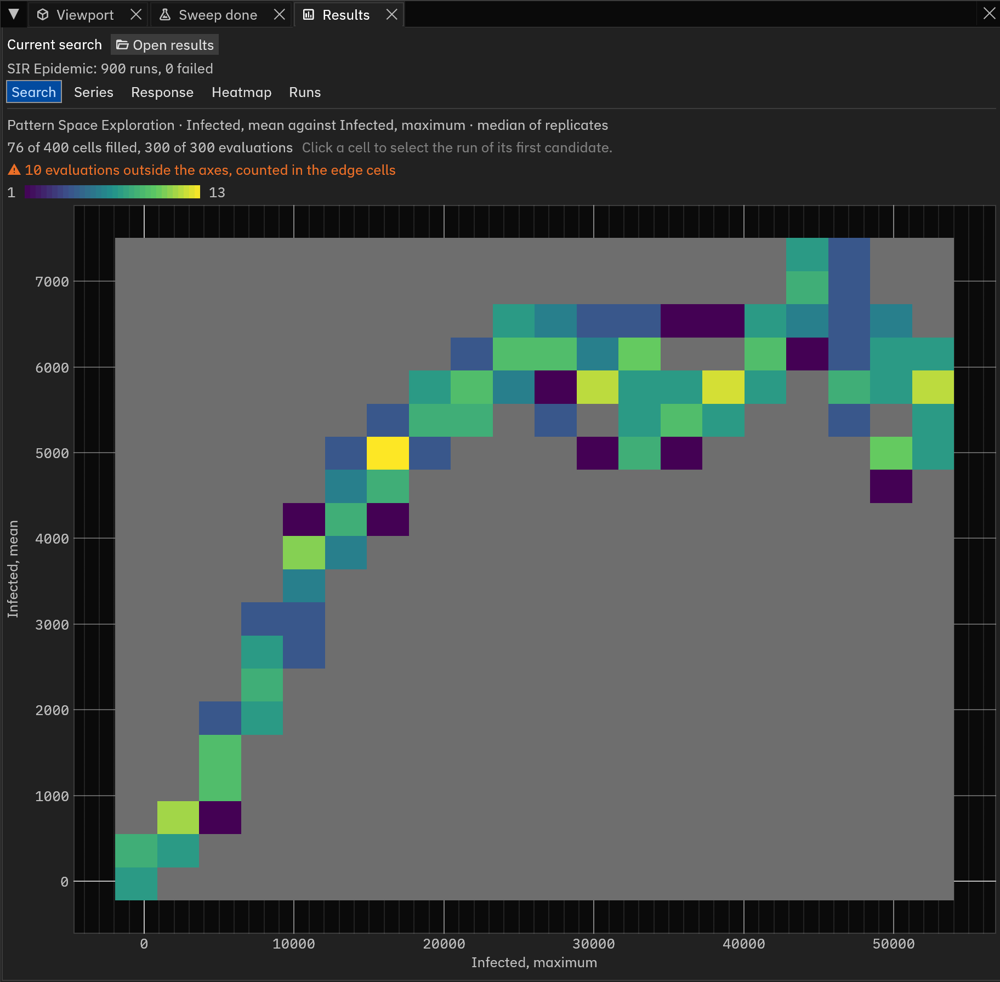{ width="700" }
<figcaption>The Pattern Space Exploration from Search mode, with 76 of its 400 cells filled. Its axes took their ranges from the initial samples.</figcaption>
</figure>

The **Search** view follows the course of a search.
Its first line names the method and its goal, as in **Genetic algorithm · maximize Infected, tick of maximum · median of replicates**.
A Pattern Space Exploration names its y axis against its x axis.

Random search and hill climbing
: Plot the best value so far against the evaluations, with a step at each batch that changed it.

Genetic algorithm
: Plots the **Best**, **Median** and **Worst** fitness of each generation.
  The best can fall when a re-evaluation shows that a leader was lucky, as [noise](search.md#noise) describes.

For these three methods, a line above the plot counts the evaluations and gives the best candidate.
<span class="ui" markdown>Select run</span> selects the candidate's first run, ready to [open](#opening-a-run).

Pattern Space Exploration
: Draws the grid of its two axes and fills it in as the batches finish, with a line counting the cells filled and the evaluations.
  With an automatic range, the grid appears once the initial samples finish.
  A filled cell is coloured by its hits on a log scale, given above the grid, and an empty cell stays blank.
  An evaluation with an output outside the axes lands in an edge cell, and a warning counts those evaluations, as in **12 evaluations outside the axes, counted in the edge cells**.
  Hover over a cell to read its ranges and its hits, and click a filled cell to select the first run of its exemplar.
  A grid of more than 65,536 cells is not drawn.

The other four views treat each candidate as a configuration, and name it **Candidate** in place of **Config**.

### Series

<figure markdown="span">
  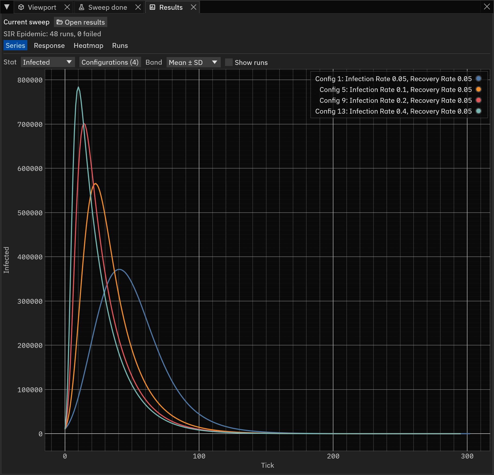{ width="700" }
<figcaption>Infected in 4 of 16 configurations, one per Infection Rate, all at Recovery Rate 0.05. The replicates barely differ, and each band is narrower than its line.</figcaption>
</figure>

The **Series** view draws one stat over time.
Each configuration gets a line through the centre of its replicates, and a band around the line.
**Stat** picks the stat, and the **Configurations** menu picks the configurations, with **All** and **None** at the top.
The first five configurations are drawn at the start, and at most ten are drawn at once.
**Band** sets the line and the spread around it:

| Band           | Line   | Band covers                             |
| -------------- | ------ | --------------------------------------- |
| Mean ± SD      | Mean   | One standard deviation either side      |
| Mean ± 95% CI  | Mean   | The 95% confidence interval of the mean |
| Median, 10–90% | Median | The 10th to the 90th percentile         |

Failed runs are left out, and a run that stopped early adds nothing past its last tick.
Tick **Show runs** to draw every replicate as a thin line, and click a line to select its run.

The app holds up to 256 MiB of series, or 64 MiB in a browser, and keeps the runs past that without their series.
The view then reads like **Series loaded for 800 of 2000 runs**.
For a folder opened in the desktop app, <span class="ui" markdown>Load series</span> reads the missing series of the drawn configurations from `series.csv`, within the same budget.

### Response

<figure markdown="span">
  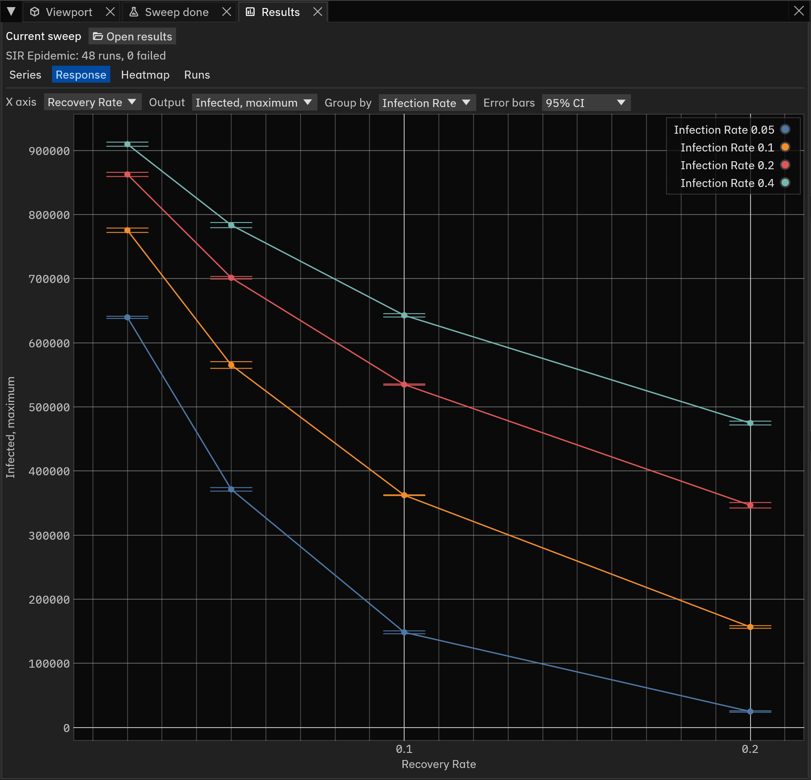{ width="700" }
<figcaption>The peak of Infected against Recovery Rate, one line per Infection Rate.</figcaption>
</figure>

The **Response** view plots an **Output** against the levels of the **X axis**, one point per level.
A point is the mean of the output over every run at that level that did not fail, whatever the levels of the other axes.
In a sweep of several blocks, such as **One at a time** writes, a point pools only the blocks that vary the **X axis**.
**Error bars** draws whiskers for the **95% CI** of the mean or one **SD** either side, or **None**.
**Group by** draws one line for each level of a second axis.
Every other axis gets a menu, such as **Recovery Rate at**, that holds it at one level instead of **Any**.

### Heatmap

<figure markdown="span">
  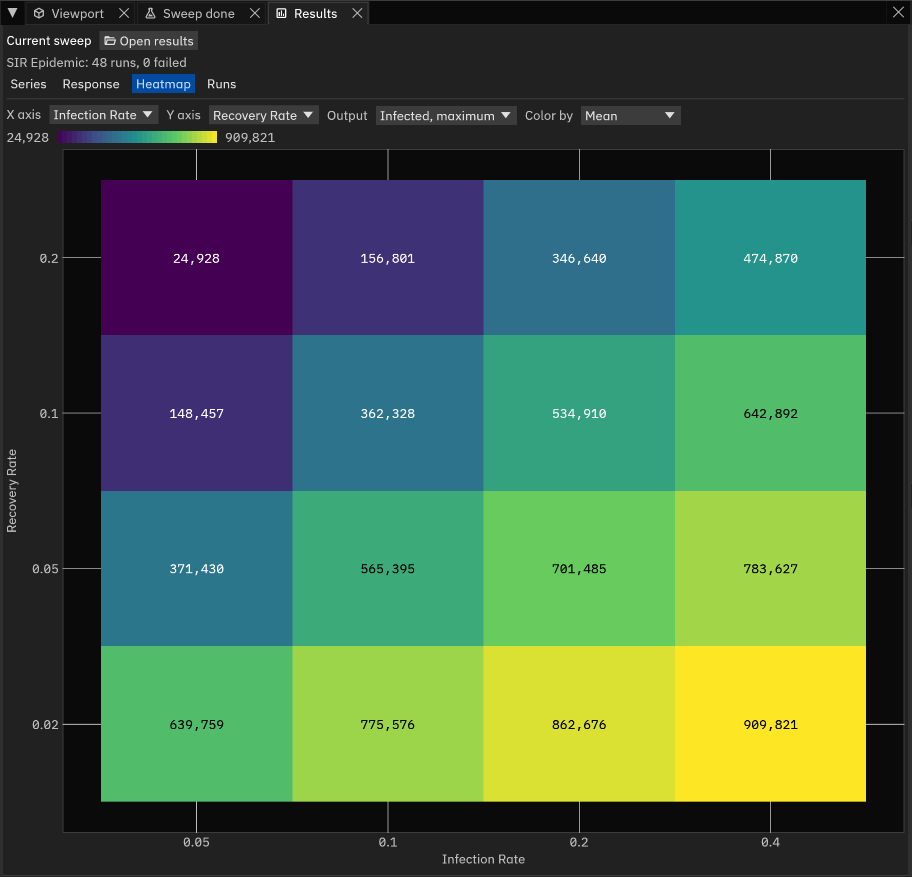{ width="700" }
<figcaption>The peak of Infected over both rates, each cell the mean of 3 replicates.</figcaption>
</figure>

The **Heatmap** view colours a grid by an **Output**, with the levels of the **X axis** along the bottom and those of the **Y axis** up the side.
An axis needs 64 levels or fewer to be a side.
A sampled design gives each parameter one level per sample, so a heatmap of one is sparse, and one of more than 64 samples has no heatmap.
**Color by** picks the **Mean**, the **Standard deviation**, or the **Coefficient of variation**, the standard deviation divided by the absolute value of the mean.
A scale above the grid gives the colours.
A grid of 100 cells or fewer also writes each value in its cell.
A grey cell has no value, for example while none of its runs has finished.
Hover over a cell to see its value and the number of runs it pools.
Click a cell to list its runs in the **Runs** view.
As in the Response view, every other axis gets a menu that holds it at one level.
A cell pools only the blocks that vary either axis, and a configuration that two blocks share counts once.

### Runs

<figure markdown="span">
  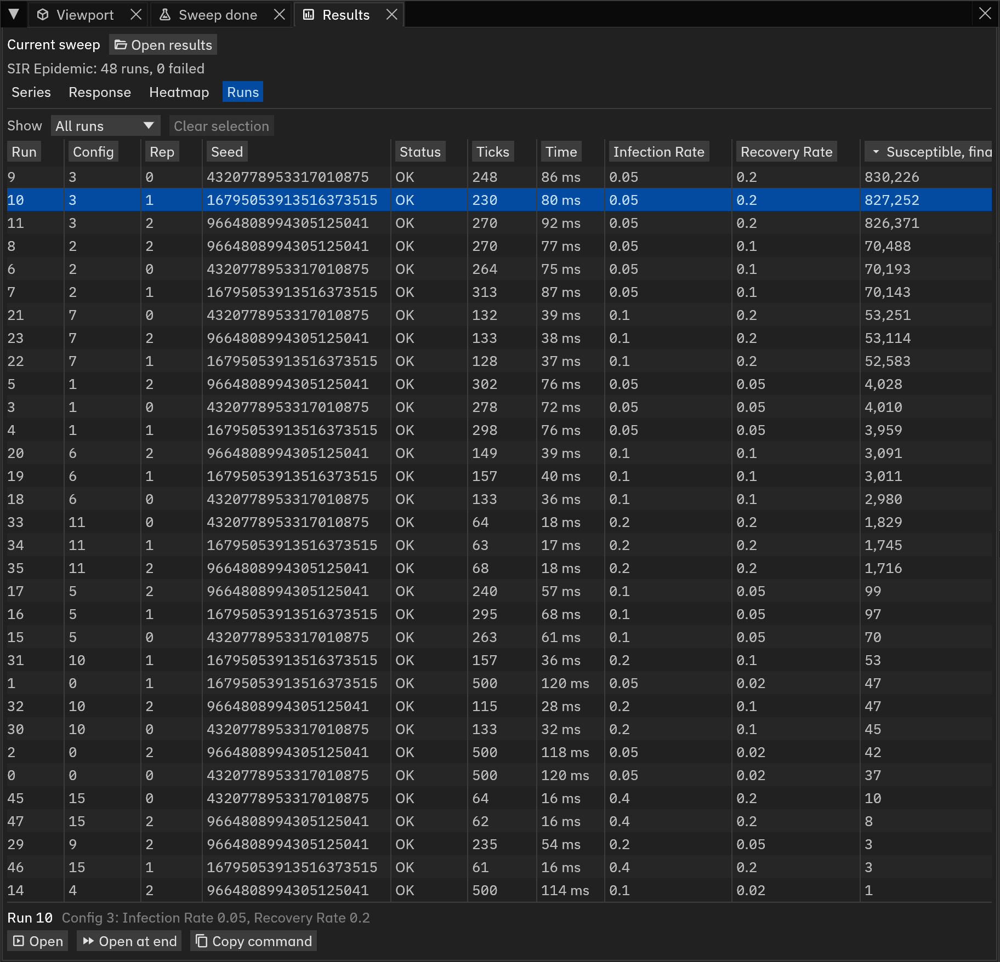{ width="700" }
<figcaption>Runs sorted by the final value of Susceptible, with run 10 selected.</figcaption>
</figure>

The **Runs** view lists every run in a table: **Run**, **Config**, **Rep**, **Seed**, **Status**, **Ticks** and **Time**, then a column for each axis and one for each output.
Click a header to sort by it, and click it again to reverse the order.
**Show** lists **All runs**, the **Failed runs**, or the runs of the **Selected configurations**.
The Series view's **Configurations** menu and a clicked heatmap cell set that same selection.
Under **Selected configurations**, <span class="ui" markdown>Clear selection</span> empties it, in the Series view too.
Hover over a status to read the run's note, such as a panic message, or the tick a stop condition ended it at.
Every status but **OK** and **Not finite** counts as failed.

### Opening a run

Click a row in the **Runs** view, or a run's line in the **Series** view, to select the run.
In the **Search** view, <span class="ui" markdown>Select run</span> and a click on a filled cell select a run as well.
A strip at the bottom of the tab then names the run and its configuration, with three buttons.

<span class="ui" markdown>:material-play-box-outline: Open</span>
: Builds the run at tick 0 with its parameters, seed and [scheduled actions](#scheduled-actions), and brings the <span class="ui" markdown>:material-cube-outline: Viewport</span> tab to the front.
  Press <span class="ui" markdown>:material-play:</span> and the run steps as it did in the sweep.

<span class="ui" markdown>:material-fast-forward: Open at end</span>
: Builds the run and [runs to](#run-to-tick) the last tick it reached.
  The <span class="ui" markdown>:material-table: Statistics</span> tab then shows the same values as the run's last row in `series.csv`.

<span class="ui" markdown>:material-content-copy: Copy command</span>
: Copies a `henad-cli` command that replays the run and writes its stats to a CSV file.

For run 6 of the [first sweep](sweeps.md#a-first-sweep) in the sweeps guide, the command reads:

``` bash
henad-cli sir --seed 16795053913516373515 --set infection_rate=0.2 --warmup 0 --steps 500 --export-stats run-6.csv
```

Run it as `target/release/henad-cli` after a release build, or put `cargo run --release -p henad-cli --` in place of `henad-cli`.

The <span class="ui" markdown>:material-play-circle-outline: Playback</span> tab names the opened run, as in **Sweep run 6: config 1, replicate 1**, or **Search run 6: candidate 1, replicate 2** for a run of a search.
A live parameter edit or an action press adds **(modified)** to the name.
GPU Boids is the one model whose runs do not replay, for the reason under [Seed](#seed).

The three buttons are disabled when this device lacks the run's model, such as a GPU model on a machine without a suitable GPU.
They are also disabled when the model refuses the sweep's spec, for example after a parameter was removed, and the reason shows below them.
A warning shows when the model's parameters changed after the sweep ran, and the replay might then differ.

### Opening results

<span class="ui" markdown>:material-folder-open-outline: Open results</span> reads the results of a sweep from its folder, written by `henad-cli --out` or by a sweep with its results **In a folder**.
In a browser, choose `manifest.json` and `runs.csv` in the folder, and `series.csv` for the series.
For the Search view of a search, choose `evaluations.csv`, `batches.csv` and, from a genetic algorithm, `generations.csv` as well.
The files are known by their contents, so a repeated download that a browser renamed, such as `runs (1).csv`, still opens.
The desktop app can also open a folder at start:

``` bash
cargo run --release --bin henad-app -- --open sir-sweep
```

The results replace the ones shown.
When those are unsaved results in memory, a **Replace results?** dialog asks first, and <span class="ui" markdown>Open anyway</span> drops them.

A folder a stopped sweep left behind opens with the runs it wrote.
In the desktop app, <span class="ui" markdown>:material-play: Resume sweep</span> runs the runs the folder lacks, as `henad-cli --resume` does.
For a search the button reads <span class="ui" markdown>:material-play: Resume search</span>, and it [replays the search](search.md#resuming-a-search) up to where it stopped before running the rest.
The progress shows in the <span class="ui" markdown>:material-flask-outline: Sweep</span> tab, and the folder is read again once the sweep ends.

## :material-gauge: Performance tab

<figure markdown="span">
  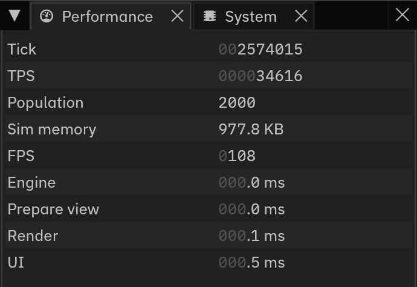{ width="420" }
<figcaption>The performance panel shows various performance metrics.</figcaption>
</figure>

Tick
: Ticks completed since the model was built.

TPS
: Ticks per second the sim thread is actually achieving.

Population
: Number of agents for an agent model, number of cells for a grid model.
  For a network model, the number of nodes, not counting retired ones.

Sim memory
: Memory used by the simulation.

FPS
: Frames per second of the UI.
  Usually unrelated to TPS.

Engine
: Time for one tick inside the engine.

Prepare view
: Time the last snapshot spent turning the model's state into something drawable, including a network model's layout.
  Reads zero for a GPU model.

Render
: Time spent drawing the simulation this frame.

UI
: Time spent drawing the UI this frame.

!!! warning "FPS is unrelated to model performance"

    Note that the FPS and the TPS are unrelated and each can be configured in different ways, as explained in the [:material-speedometer: Pacing tab](#pacing-tab).
    The TPS is the true measure of how fast the simulation is running.

## :material-chip: System tab

<figure markdown="span">
  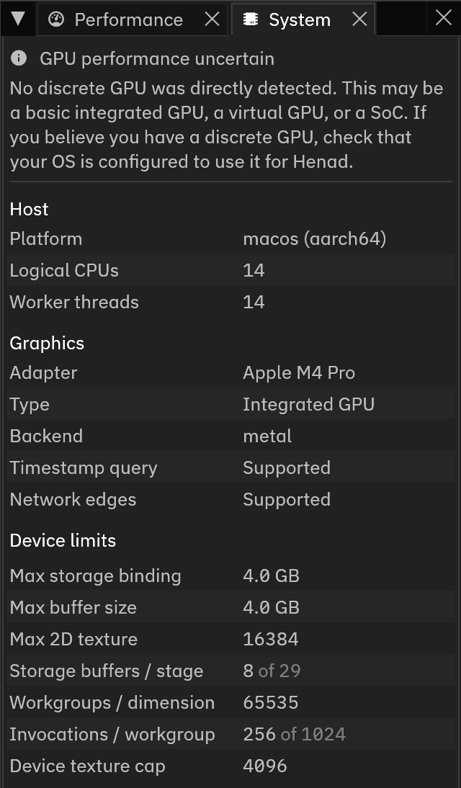{ width="380" }
<figcaption>Host, adapter and device limits information.</figcaption>
</figure>

Information in the <span class="ui" markdown>:material-chip: System</span> tab are generally technical information used for debugging purposes.
It can also be used to check if the correct GPU adapter is being used, and if the device has enough resources to run a model.

The **Network edges** row shows whether the GPU can draw the edges of a network model.
When it reads Unavailable, network models still run, but their edges are not drawn.

A banner at the top appears when there are potential compatibility issues with the GPU, and can be one of the following:

| Banner                                           | Issue                                                                               |
| ------------------------------------------------ | ----------------------------------------------------------------------------------- |
| :material-information: GPU performance uncertain | No discrete GPU was directly detected. This may or may not affect performance.      |
| :material-alert: No GPU detected                 | Rendering is going through a software rasteriser, and GPU models will be very slow. |

## Model build and simulation errors

Henad checks a model's buffer sizes, texture dimensions and per-pass binding counts against the device before models are built.
If a model cannot be built, <span class="ui" markdown>:material-restart: Build</span> is disabled, and the limits that were exceeded are shown in the <span class="ui" markdown>:material-tune: Parameters</span> tab's banner.

At runtime, there are two possible errors that can occur:

Model build failed
: The GPU refused the model while it was being constructed, or a kernel panicked during setup.

Simulation aborted
: Something went wrong on a tick, and the simulation was stopped.

When such an error occurs, a modal dialog appears with the error message.

## Browser-specific notes

Although Henad is designed so that the web app runs identically to the native app, there are some differences due to the limitations of the web platform:

- **GPU time/step** reads `N/A` due to backend limitations.
- **Layout budget** is capped at 6 ms, the time the simulation gets in each frame.
- Device limits can be lower than the native app as broswers may not expose the full capabilities of the GPU.
- Append `?threads=N` to the URL to cap the worker pool.
- The <span class="ui" markdown>:material-flask-outline: Sweep</span> tab sweeps and searches CPU models only, and a GPU model shows **GPU sweeps are unavailable in a browser.**
  <span class="ui" markdown>:material-tray-arrow-down: Save spec</span> still saves its spec for `henad-cli --spec`.
- A sweep or search steps one run at a time, a little in each frame, and **Concurrent runs** stays at 1.
- The results of a sweep or search stay in memory, and **In a folder** is disabled.
  Closing the page loses them unless you press <span class="ui" markdown>:material-tray-arrow-down: Save results</span>.
- A panic in a run of a sweep or search ends the page.
  The desktop app records such a run as failed and carries on.
- A browser cannot open a folder, and <span class="ui" markdown>:material-folder-open-outline: Open results</span> reads the files picked from one.
  <span class="ui" markdown>:material-play: Resume sweep</span>, <span class="ui" markdown>:material-play: Resume search</span> and <span class="ui" markdown>Load series</span> need the desktop app.

*[UI]: User interface
*[TPS]: Ticks per second
*[FPS]: Frames per second
*[CPU]: Central processing unit
*[GPU]: Graphics processing unit
*[SoC]: System on a chip
*[stat]: Statistic
*[CSV]: Comma-separated values
*[TOML]: Tom's Obvious Minimal Language
*[SD]: Standard deviation
*[CI]: Confidence interval